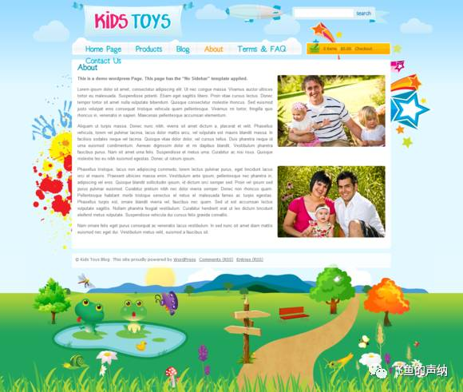
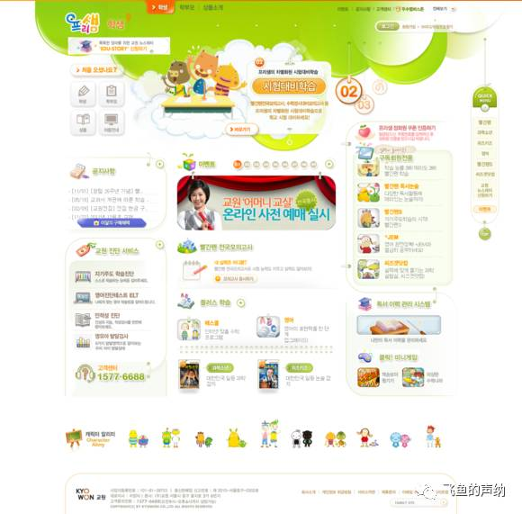
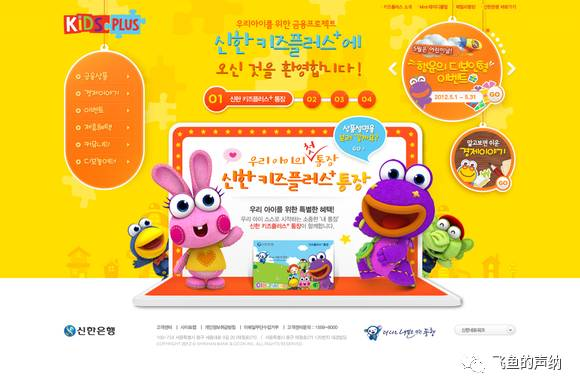
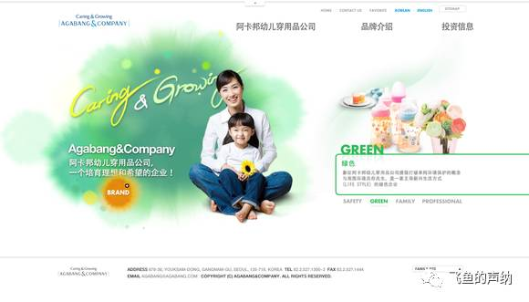
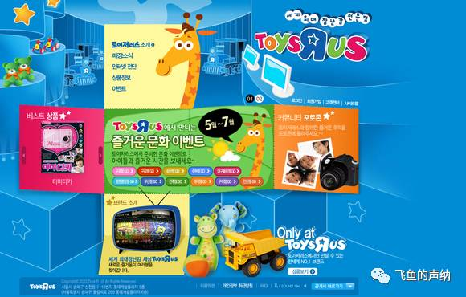
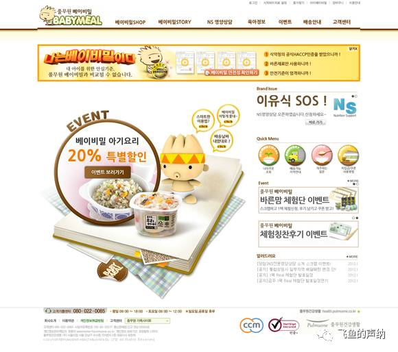
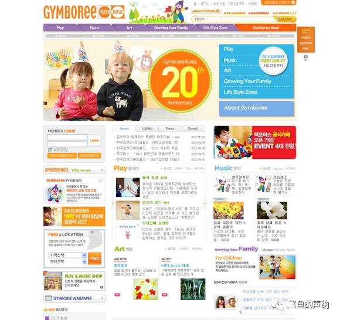

一、温馨而柔和

高亮度，低饱和度的黄色和绿色色彩营造出柔和温馨的气氛，重要信息部分用饱和度较高一些的绿色和红色跳出。而背景中随机大小的圆形叠加增加梦幻、可爱的氛围。其余的设计元素，例如云朵般的曲线边缘、logo和导航的针脚线、导航条背景的大头针、宝宝日记的贴纸、宝宝照片吊牌、以及文字标题的手写字体都围绕着整个设计风格来运用，营造出整体温馨的气氛。

二、万物复苏的春天来了

这个设计看上去也是偏柔和的风格，像是刚刚到来的春天，到处都是嫩绿的颜色。色彩方案上使用了两种高亮度、中低饱和度的黄色和绿色的搭配，导航也用了连续的云朵状的弧形和手写的字体，增加可爱温馨的氛围。主视觉的插画对于整个设计氛围的提升起到了非常重要的作用，挂在树上的条幅写上了博客的Logo，增加了趣味。但是布局上类似于页面似的方方正正的布局却是中规中矩，缺少了创意和突破。

三、色彩鲜艳、阳光明媚的春天

色彩饱和度和亮度非常高的天空、云朵、山峰、太阳、草地以及各种卡通动植物构成的插画背景是营造整体气氛的最主要的元素。为了让背景融合与整体设计之中，logo的条幅被小鸟衔着挂在空中，飞艇拉着搜索框也漂浮在蓝天之上。主内容区左侧的水彩墨迹和手印、右侧飞跃而出的动感的星形更增强了欢乐、可爱的氛围。云朵状的导航条和可爱风格的手写文字虽然略显粗糙，但是依然延续了同样的设计风格。主内容区两张阳光明媚、充满欢笑的家庭照片更是让人感觉春意盎然、暖意融融。

四、清新柔和

大面积的低饱和度、高亮度、偏绿一点的蓝色给了这个设计平静和清新柔和的心理感受。再配合粉色系的红色、黄色、绿色的局部色彩，让整个设计摆脱了过于单调的色彩方案。其它在这个设计中值得关注的的设计元素有：1、类似于格子布纹的背景材质；2、云朵状的主内容区边缘；3、logo、导航文字、标题的手写字体；4、曲线吊牌和按钮；5、各个内容区域添加的低调的插画背景。

五、灵活的布局

打破框架的信息布局方式和众多细碎的信息区块是这个设计给人的第一印象，不同信息区域的不同设计方式让人产生探索的欲望。可爱的风格贯穿于整个页面，白色和高饱和度以及亮度的绿色、橙色搭配又给了页面清新的感受。手绘风格的插画是儿童网站中不可或缺的元素，非常能够调动网站的整个气氛。圆形以及大圆角的边框设计样式也契合了整个页面的风格。不断出现的吊牌、打孔日历的设计相互呼应，并且起到了划分各个信息区域的功能性作用。最为重要的是，这个设计摆脱了前面几个设计主内容区大框架的限制，布局上更为自由，作为儿童网站来说，这是需要这样的创意方式。

六、热烈的气氛

这是一个气氛相当足的全Flash韩文站点。气氛的营造和黄色以及橙色的大面积使用有着直接的关系。虽然主色调是这两种颜色，但是却并不仅限于这两种色彩的使用，粉红色、紫色、蓝色、绿色也都出现在了这个设计中，但是色彩比例上来说，它们要少得多，所以能做到在丰富色彩方案的同时又不喧宾夺主，冲淡或者相悖于整体的气氛。整个页面没有完全填充为黄色，底部页脚部分的白色既给类似于打开的贺卡的主视觉提供了稳固的水平面，也给整个设计增加透气的心理感受。大面积的渐变黄色背景中叠加了卡通图案，增添了设计层次，营造了设计的基调。Logo多色彩的拼图方案和背景的拼图图案相呼应，向下顺延视线的大圆角吊牌作为导航的设计样式，并使用了手写的卡通字体，右边相关活动内容的圆形吊牌也采用了类似的设计。可以观察到，圆角的白色描边在这个设计中重复出现，可以作为关于儿童的网站设计的细节考量。

七、清新淡雅的东方风格

大面积的白色加上晕开的水彩背景以及主视觉部分温馨的家庭照片使得这个设计带给人柔和、清新的感受。页面上的元素，例如导航等没有做过多的修饰，这正是这个设计大胆的地方，而我们通常的想法却是不加点图层样式的效果就会觉得拿不出手，觉得这就不是设计。原因是我们头脑中没有设计的大方向所在，完全是被惯性盲目的驱使着往前走，最后设计成什么样子，走到哪里完全没有概念。而这个设计教会了我们更大尺度的设计思想，让我们尝试不同的设计方法，在设计上走的更远一些。

八、前期创意的重要

蓝色的背景作为玩具陈列的展厅和主信息区域的色彩形成鲜明的对比，让主信息区域从背景中跳出来。类似于打开的玩具盒子的创意既和网站主题相关，又增添了更多的趣味，而这是在动手开始做具体设计之前完成的创意。所以要设计一个网站，在打开Photoshop之前的工作其实对于设计的走向起到非常重要的作用。这部分的内容包括研究阶段以及画草图，这是要设计一个优秀的网站必不可少的工作。

九、安静的色彩方案

这是一个黄色、橙色到棕色色彩方案的设计案例。基本属于同一色相、不同层次色彩的搭配，所以整体上相较于多种跳跃较大的色彩方案来讲，氛围会安静一些。由于此网站的业务是提供婴幼儿的营养餐，所以暖色系的平静色色彩方案反而会更适合一些。

十、下半部分稍显破碎

多种高亮度和饱和度的色彩的应用依然是儿童网站设计中最常见到的思路。此网站主页的信息量比较大，主视觉以上的部分结构清晰，视觉感受不错，但是主视觉以下的部分栏目过多，组织的不够清晰，显得有些破碎。”Play”、”Art”、”Music”和”Family”四个并列的板块如果在视觉上做到更为清晰的划分，标题文字跳出正文文字的包围可能视觉效果更好。但是可以看出设计师在主要信息区域使用白色以及亮度较高的灰色和多种色彩搭配，试图营造出清爽、干净的氛围。只是在信息的组织和视觉呈现上做的还不够，可以有更为深入和思考。

