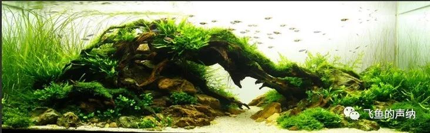
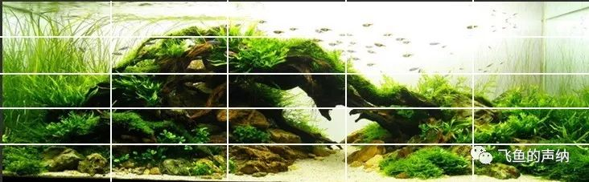
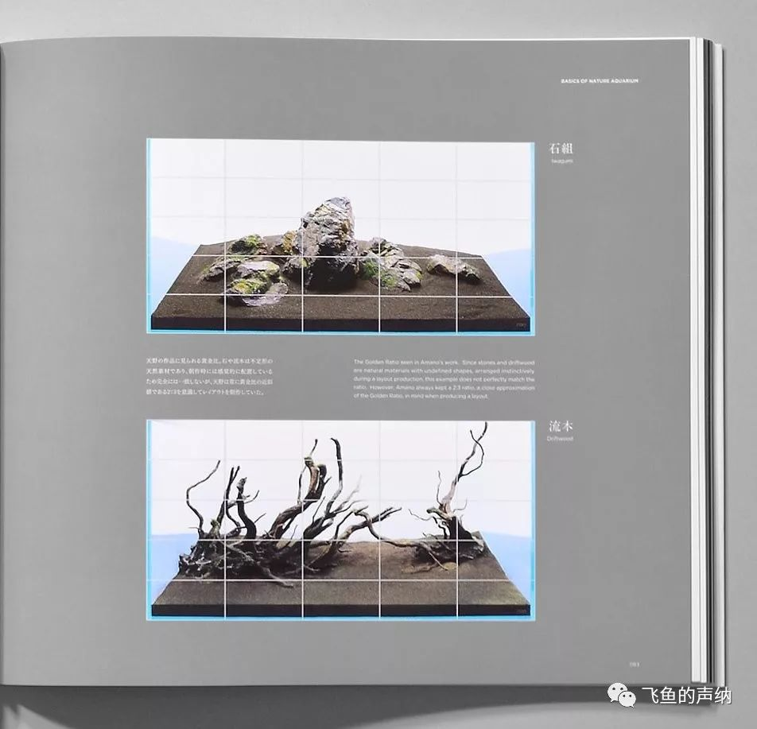
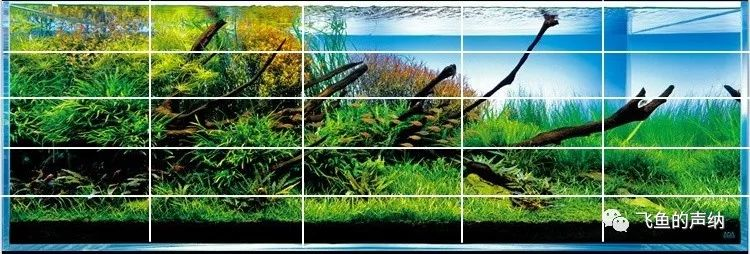

构图是草缸造景的基础环节，是决定造景成败的关键性因素，造景样式可能千变万化，但其中却包含普遍适用的原则。了解这些背后的设计原则对于指导造景是非常有帮助的，这篇文章我将通过几个案例来尝试分析一下其中的规律。

上图草缸的设计是一个典型的运用黄金比例构图创建视觉平衡的案例。下面我们就来一一分析。直接看图片不便于看出其中所运用的设计原则，因此我们将此图片上下、左右五等均分，把这个设计放在网格中观察，我们就能直观的观察出其中的设计技巧。

有这么几个点值得注意：

一、为了增加纵深感，前景使用了化妆沙，并向远处延伸，沙子创造出的透视的灭点正好在画面从左至右的三分之二黄金比例的位置。

二、沉木和石头构成的类似拱桥的造型是画面中的主视觉，基本占据了画面中间部位16至18个格子的空间，接近全部25个格子的三分之二，上下左右都有留白。

三、同时，顶部的留白大概有8至9个格子，站到总格子数25个的接近三分之一的空间。

再来用这个方法分析一下其它的设计，如上图所示的两个设计。石头的一组造型高的石头基本处于中间的位置，占据三个格子，左右对称，视觉上平衡。左右两侧的石头均匀分布，整体的造型占据了9至10个格子的空间，是全部25个格子的三分之一。主视觉部分面积较小，留白较多，成景后会营造出开阔的场景感受。

沉木的一组造型分为两个部分，左侧沉木占据水平和垂直五分之三的空间，右侧的沉木如果再将剩下的五分之二的空间占满的话就缺少了留白，画面会显得过于堵，因此到这里其实有两种设计方案，一种是右侧全部留白，什么都不放；另外一种方案如上图，放置小面积的造型作为呼应，数一数，发现右侧的沉木大概占据了6至7个格子的空间，这样加上左侧的格子数量，总数量是16至17个，也就是总格子数的三分之二。

我再顺手拿一个案例分析一下。这应该是ADA造景大师天野尚的作品。

这个设计中，主视觉都集中在左侧，右侧留白，造型部分占据了14至16个格子，也是三分之二的面积。应用了同样的设计原则。通过画出的网格可以观察到一个细节，那就是群鱼的位置，正好处于画面的正中央，可见这张图片一定是经过精挑细选的照片。