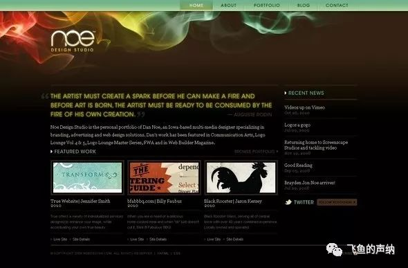
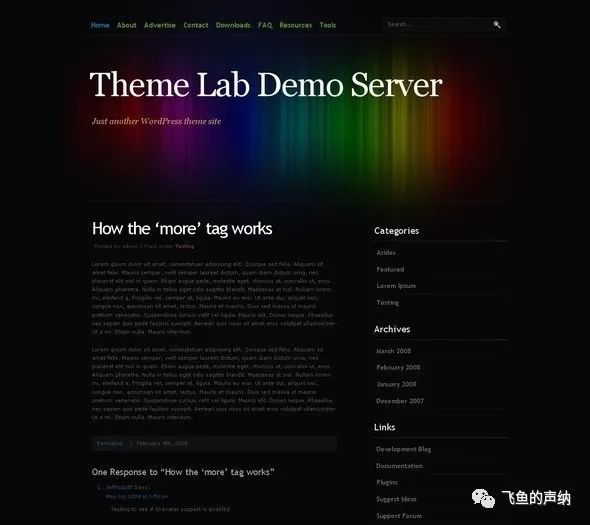
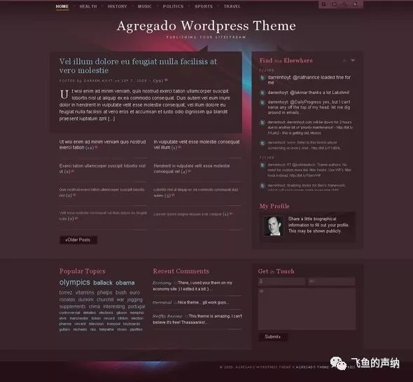
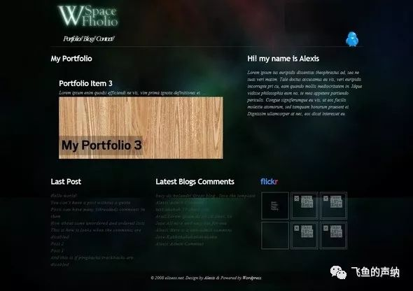
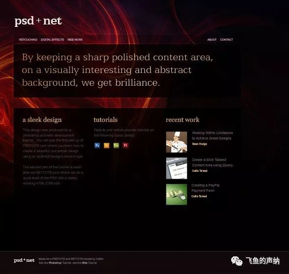
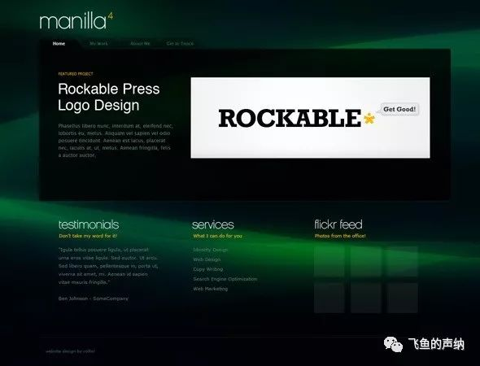

炫彩和透明风格的网页设计是我个人喜欢的设计风格之一。下面的设计作品和教程是我接触和收集到的这一类的设计风格的代表。这些作品和教程可以在我们动手创建个人的网页设计时给我们以启发，并且教会我们实际实现的技巧。总结起来，这些设计有着如下共同特点：

一、非常漂亮的抽象背景图片，内容以光晕、烟雾类为主。这些图片有着非常好的渐变，可以很好的和网页背景色融合在一起，便于后期代码实现实际的效果。在站酷上搜索这一类的素材，你会发现很多非常漂亮的图片可以用到你的设计上。

二、简洁的排版和字体。你会发现这一类设计页面上文字内容普遍较少，目的是突出吸引人的背景图片。元素与元素之间会留有充分的空间，这样会让网页看上去更有品味。文字会直接放置于背景图片之上，很少有过多的装饰元素。文字字体经常使用线条较细的字体，这样会更加凸显简洁干净的风格。

三、透明的内容区域。我理解，透明的元素不但给人高端、干净的感觉，还让背景图片能够透过元素凸显出来，减少因为元素的遮挡从而让原本漂亮的背景失去吸引力。

四、1个像素的高光。这样的细节绝对不可忽略，因为它给你的设计增加了品质感。只有在细节上做很多的工作，才能做出不一般的作品。

以下是这些设计作品和教程的截图：

