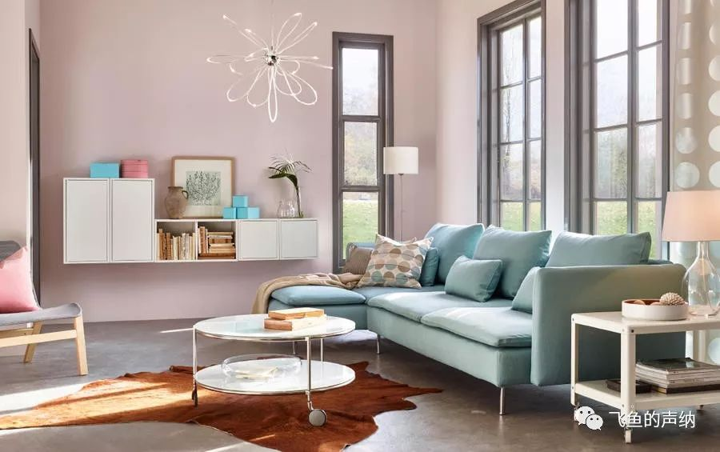
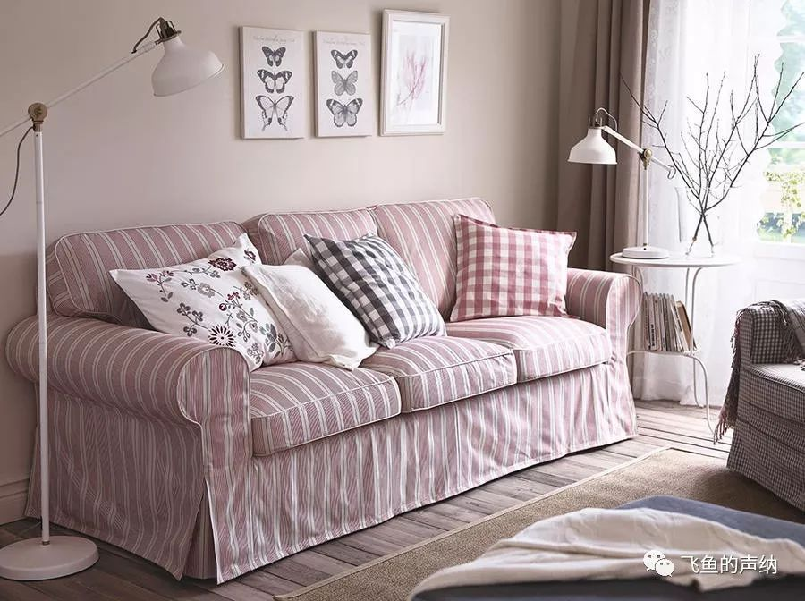
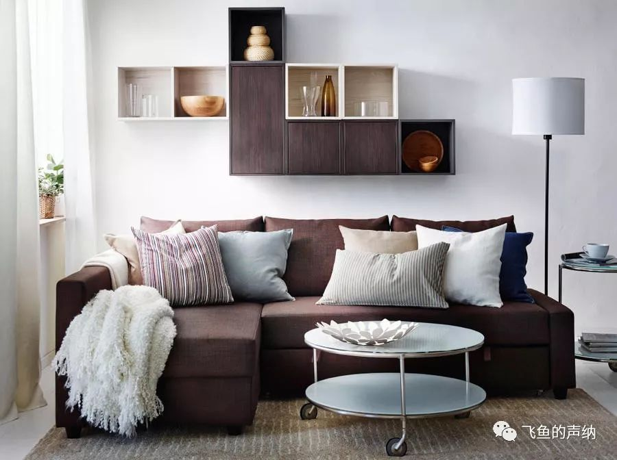
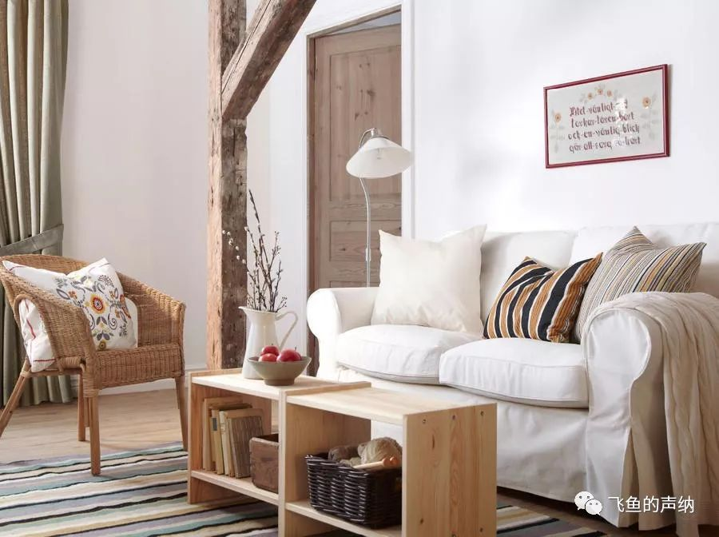
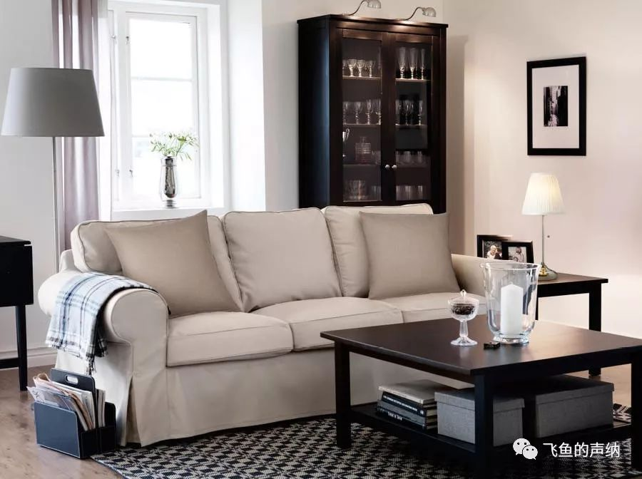
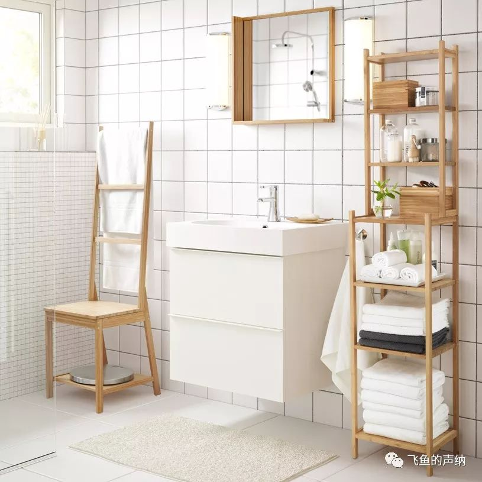
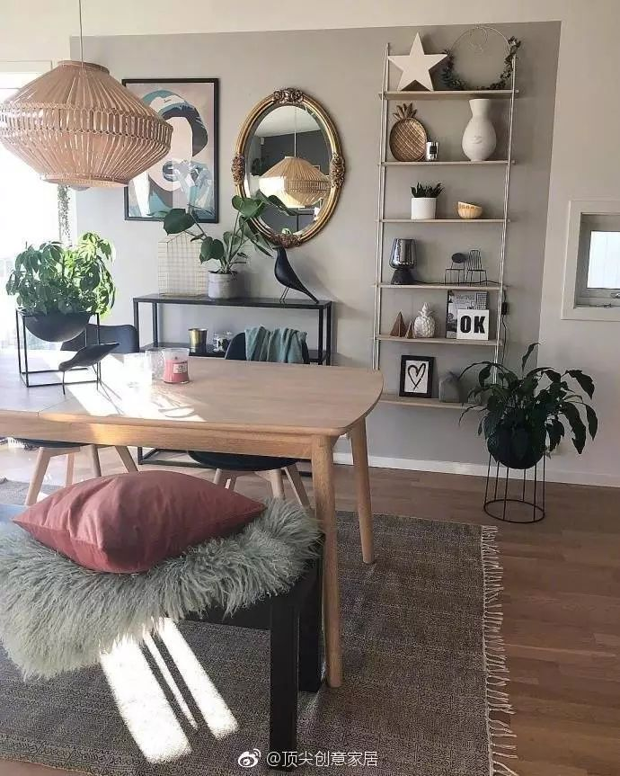

### 浅粉和浅蓝的对撞

很别致的粉色系红色配蓝色的设计，从这个设计案例中同样可以的出来，北欧风格偏爱色彩纯度低的颜色，灰色的地面，大面积低纯度粉红色的墙面，搭配蓝色的沙发，清新活泼的感觉。

### 低纯度的粉色调

北欧的家居设计风格透露出简约、安静之美。其中一个重要的原因是偏爱低纯度的色彩，就像这个设计，无论是地板、墙面、沙发、窗帘的色彩纯度都很低，再加上每个单品简单干净的线条，独特的味道自然流露。

### 补色的平衡

简单的白墙白地，只靠软装来体现设计感，棕色为主色调，同色系的米色搭配棕色，补色浅蓝色作为平衡色平衡一下冷暖搭配。

### 原木的质朴

明亮、质朴是这个设计带给人的感受，原木色的地板，微带色彩的墙壁，白色的门框，白色的踢脚线，近乎于白色的沙发整体营造出明亮的基调，原木色的茶几、藤椅、木门是设计中最深的颜色，房间中粗犷的木头柱子是最具个性的地方。

### 有力度的单色系

偏灰的粗纹理木地板，略带暖色的墙面，白色踢脚线是整个空间的的设计基调。米色的沙发是整个画面的主角，也是主色调，至此，整个设计都是亮色调，浅色调的，接下来用深灰色的边桌、茶几、玻璃门柜、画框来搭配，整个客厅布置的层次感在米色和深灰色的强烈对比下立刻显现出来。整个的设计感觉很安静。

### 小清新的浴室

整体上干净、自然、放松的感觉。色彩上，白色打底，地板、墙壁、柜子、毛巾都是白色，搭配主色自然感受的原木色，配合小盆栽的绿色作为强调色。质感方面，凸显原木的质感。形状线条方面：多为线条简洁的矩形，地板、墙壁、柜子、镜子等。

### 质朴而安静

北欧风格空间设计能够打动人的原因，就是它常常带给人的质朴、安静、简洁的情绪感受。

如果你觉得这样的设计感觉稍稍有些闷的话，可以用纯度稍高一些的色彩和绿植来增加一些活力。就像这个设计中粉色和靠枕、蜡烛和房间里的绿植所起到的作用。

原木色的桌椅和吊灯是整个灰色空间中的主角，也是画面的主色调，用原木色做主色几乎是自然风的北欧风格永恒不变的设计原则。接近于黑色的花盆、边几、画框是画面中最深的颜色，但是面积很小，给整体设计增加质感的同时不至于让空间过于压抑，白色踢脚线和部分白色墙面可以让空间显得更加轻盈和明亮。

背景墙的浅灰色看上去非常安静，和木纹地板、浅灰色的地毯构成了整体设计的背景和基调。