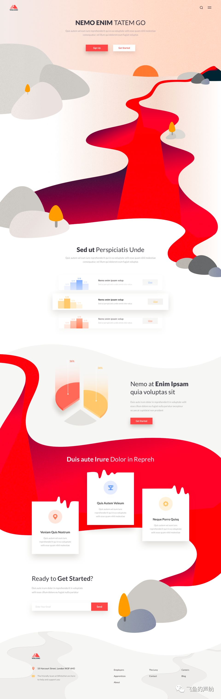

### 平面转化成立体

扁平化设计风格，独特的地方在于富有空间感的火山和地心的插画的绘制让这个设计有了看点，也契合 Volcano（火山）这个主题。这样的 Banner 创意可以作为扁平化设计中的一种思路，把平面转化成立体，瞬间就能让设计高大上起来。

红色作为主色调，搭配灰色，没毛病。

### 让设计有文艺气息

赏心悦目的设计，首页的版式布局很有特色，基本上是左边占据 2/3 的版面，右边 1/3，左右高低不一且三个信息区块样式各不同，给人自由、灵活的感觉。

主视觉区域 798 三个 3D 文字作为视觉的第一层次，细节丰富，大小各异、错落有致，文字上添加上欧洲的古典人物形象，艺术气息更加浓厚。再观察背景，云彩的添加给了 3D 文字空间感，感觉文字像是漂浮在了空中。最后是接近于灰色的背景色，仔细观看会发现背景色也添加了细微的渐变。整个主视觉区域的设计细节完美，3D 文字的设计应该是其中的难点。

### 光亮风格

这是国内著名设计师辛旭起的设计作品。

整个设计给人可爱清新的情绪感受，这和设计的整体创意，以及设计中元素的选择、色彩的搭配、质感的表现是分不开的。

先来看设计的创意。“快速美白”无疑是整个设计的关键词，围绕这个关键词展开联想，我们可以看到设计中出现了与此相关的代表时间的钟表、代表美白变化的照片等设计元素，有些元素的选择虽然和关键词有一些的距离，例如画板、棒棒糖等设计元素，只是用来烘托气氛，但整体上的构思和关键词还是相关的。

再来看 Banner 部分的视觉设计。整个 Banner 视觉饱满，其中的元素较多，但按照信息内容来看，大体可以分为这么几个部分，一是画面中心的牙膏以及围绕在产品周围的钟表、照片、画板、椅子等元素，这是一个视觉部分，第二个部分是牙膏上面部分带有花朵、棒棒糖以及蝴蝶结陪衬的视频播放器，第三个部分是“一刷即白”的 slogan，最后左上角的兔兔爱表白的游戏快速通道是一个视觉部分，这几个部分从前至后分别有着从重要到次要的视觉关系。每一部分的设计都基本包含有三个视觉层次，拿最重要的产品部分的设计来说，牙膏作为前景元素是第一层次，周围的钟表、画板等元素作为中景可以看作是第二个层次，而背景的渐变、云彩、气泡等元素是第三个层次。视频播放器部分的设计也一样，无疑不规则形状的播放器是一个层次，棒棒糖和花是一个层次，而这些元素之后的背景又是一个层次。

配色是这个设计中的亮点，整体看上去丰富而不杂乱。从大的配色上来看，产品本身的蓝色是作为强调色的角色出现的，偏红的紫色和蓝色是邻近色，作为背景色来用，橙色和黄色又和红色临近，另外再搭配一点点的绿色，整个作为辅助色出现，整体的色彩纯度较高，因为都是邻近色，所以虽然纯度高，但看上去并不冲突，所以整个设计的配色感觉很丰富，没有单调的感觉。

从质感上来说，设计中大量使用了光亮风格的设计，这种质感的选择应当是从牙膏本身的双层的晶莹啫哩膏体中得到的灵感。网页的渐变色背景、导航栏边缘透明发光效果、视频播放器的镜面效果、牙膏的倒影、slogan 文字背景的渐变和光效，都是和这种光亮质感相契合的。

所以我们可以看到，单从视觉上来说，丰富的层次构成的饱满的画面，统一风格的设计元素，丰富的配色，统一的质感表现共同支撑起整个设计的气氛和味道，缺一不可，也体现了设计师视觉方面高超的控制能力。

### 木质的使用

这是一个属于儿童设计范畴的网页设计案例—好奇纸尿裤韩版设计，通过这篇文章的分析，尝试提炼和把握此类婴幼儿用品的设计风格和表现手法。

上面的图片选取了设计中的几个页面，包括首页和内页，纵观整个页面的设计，我们能够感受到这个案例柔和、可爱的设计情绪，这样的设计风格在涉及婴幼儿产品的设计中非常常见，是需要熟练把握的设计风格，通过分析我们来看看要实现这样的设计，这个案例是如何做的。我们一个方面一个方面来分析。

一、布局

先来说页面布局。此设计案例在布局上采用垂直划分的布局方式，首页上最左侧垂直区域放置导航、搜索、视频链接等信息，中间栏放置最新产品、俱乐部、社交平台及搜索表单，右侧为主要内容区，放置 Banner 图和分栏信息。内页根据页面信息的需要从首页的三栏变为了两栏，最左侧的导航栏保持不变，紧挨导航栏的是主要内容信息区域。垂直布局区别于常见的水平分割布局方式，带给整体设计新颖的感觉。

二、色彩

在色彩搭配方面，这个设计的色彩方案并不复杂，毋庸置疑，红色是作为主角色使用的，无论在导航条背景、按钮颜色以及标题颜色上都有体现，高纯度和亮度的红色在大面积的白色背景上显得非常显眼。木质的黄色和 banner 中幼儿皮肤的黄色作为配角色在色环上和红色临近，和红色相比较面积要小得多，搭配起来自然不成问题。大面积的白色是百搭，可以观察到 banner 中的幼儿的衣服、窗帘、沙发、地板的颜色也基本都接近于白色，目的是不扰乱整体的色彩搭配，从这里足可以看出设计师在控制色彩方面的用心。

三、质感

质感的选择也是值得注意的一个方面，也是整个设计的创意的重点体现。导航条部分布纹质感和中间栏部分木质的使用给整体的设计增加温馨、自然的情绪感受。创建布纹和木质的元素难度并不大，类似于这个设计案例中的导航条的质感设计只需要在 Photoshop 中创建类似的图案，然后应用在图层样式中即可。木质材质的创建也是同样的方法，只是创建无缝拼接的图案稍微复杂一点，我在之前的写的一篇文章《在 Photoshop 中创建不规则无缝拼接图案》中介绍了创建复杂图案的方法，大家可以参考。创建好图案之后再使用调整图层调整色相、明度、纯度就可以实现期望的结果。

四、元素

其它细节方面，为了营造柔和、可爱的感受，可以观察到形状元素中大量使用了圆角和圆形，包括 banner 上字体的选择，也可以看到圆角特征的存在。虚线元素也是值得注意的一个方面，无论在导航文字还是首页分栏信息的划分中的使用。都和整体柔和、可爱的设计风格相契合。另外在图片的使用中选择了较多的卡通图案，增强了可爱的设计味道。

五、图文混排

然后是各个信息元素的样式设计。在这个案例中可以看到无论是哪种类型的信息元素，无论进行了怎样的创意，基本都采用了图片加文字的设计方式。图片的使用让设计有了视觉焦点和看点。为了让设计更加生动活泼，大多数图片都经过了处理，去除了生硬的边框，这样和背景融合的更像一个整体。例如下面这个小栏目的设计：

由于内页的栏目和信息内容较多，图文混排的设计方式更是大大提升了页面的视觉效果，让整体的设计更加生动，视觉更加美观。可以想象，如果去掉了这些图片的搭配，这个页面将会显得单调而枯燥。

六、避免重复

在这个案例内页的设计上可以明显的注意到，每一个单独的信息内容的设计样式都是不同的，根据不同的信息内容的特点设计师都进行了不同的创意，保证了整个页面在设计方面不重复，有趣味。拿上图中最后一幅图来举例，整个主要内容区域的设计由以下四个部分组成，每一个部分的设计样式都独一无二，既符合整体的设计风格，又都有各自的特点。另外可以看到这四个部分的视觉比重从上到下不断递减，这和页面信息从上到下的重要程度的差别也是相吻合的。

建议大家对这些栏目的设计临摹一下，整理保存成 PSD 文件，这样做的好处是既开阔了创意的思路，提高了设计的技术，还可以在以后做类似风格的设计时将这些成型的东西直接拿出来用，大大提升设计的效率。

OK，关于这个设计的案例的分析就到这里，分析总结虽然重要但是一定不是最重要的，最重要的大家都知道，勤快一点，多动手是永恒不变的真理，唯此才能不断的积累经验，让自己提高。
