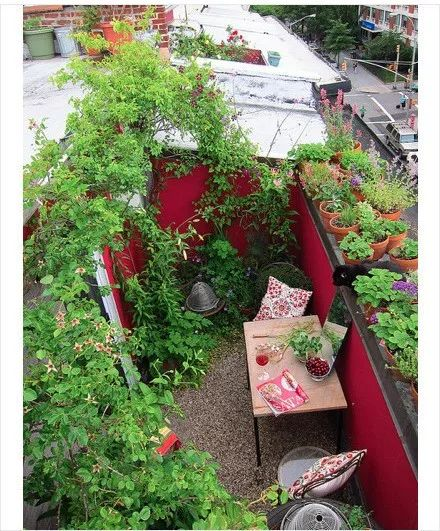

### 大小石头，美丽花园

喜欢这种风格的花园设计，拥有大片繁密的植物花园固然很美，但看多了也会审美疲劳，何况太多的植物有时却会伴随着潮湿、蚊虫和少许的压迫感，而上图这个花园的设计风格很容易让人联想到北方给人的感觉，空旷、干燥，但也不乏生机勃勃。细碎的灰色石子铺满整个庭院，散落几个类似磨盘的圆形石材，石材上架起锈迹斑斑的槽钢，中间填充大小不一的鹅卵石，为了让钢材的材质和细碎石子的材质视觉上过度的更柔和，在槽钢的下放也摆放上了一堆石头，至此，这个花园局部的结构已经完成，接下来该让植物出场了，很简单，随意的在碎石中点缀种类不同的几种植物，但是这其中最出彩的还是石碓缝隙中的几处植物，和石头搭配感觉似乎是自然生长出来的一样，很自然的感觉。

### 海滨城市的阳光露台

在一个空气干净清新的海滨城市，能拥有这样一个一眼就能看到漂亮风景的露天，简直是一件难以想象的太过于美好的事情。不精心的打造这个露台花园，绝对是一件说不过去的事情。还好这张图片看上去是那样的完美，高处的藤蔓植物爬上了墙头，铺上了大面积的绿色，环绕在沙发四周最经常出现在视线里的是一大片黄色、紫色的花最为花园的中景，低处的镶嵌在石板中间的前景植物和墙角草也展现了良好的生长状态。这样漂亮的花园上再撒上明媚的春日里的阳光，不用说在这里小酌一杯，就是坐一坐就是一种无比美妙的体验！

### 随意自然的阳台花园

只要花草长得好，随意一点、杂乱一点看上去还更自然，摆上一张桌子，两把椅子，再来一杯红酒，一本杂志就能带给人一段让身心放松的美好时光。
