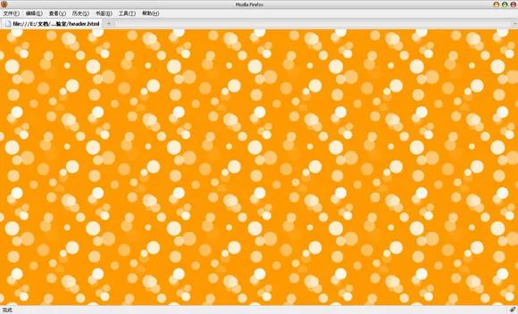
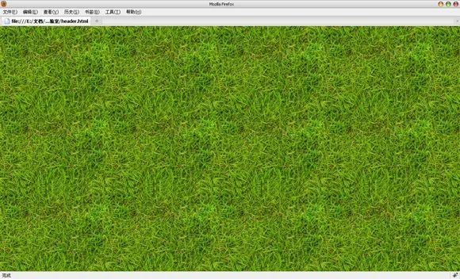
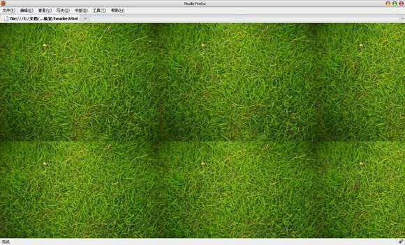
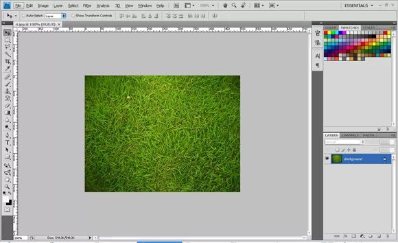
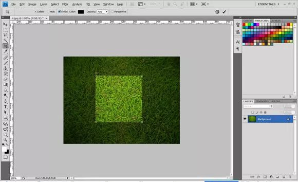
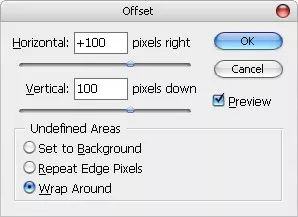
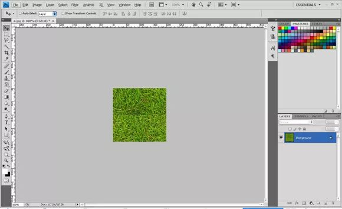
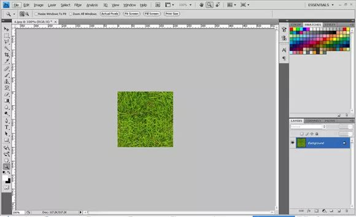
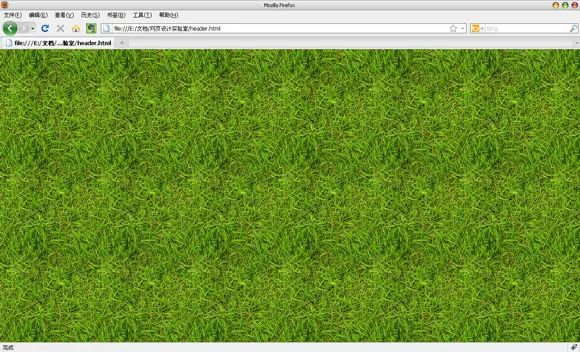

如果你仔细观察飞鱼的声纳的黑色背景的话，你会发现其实它并不是纯色的背景。而是一张有着细微质感的无缝拼接图案平铺以后的效果，这张图片是我从网上找的现成的图片，直接在CSS中使用就可以了，很简单。但是有些无缝拼接的图案却更复杂一些，图案不像这张图片那样规则，比如下面这张平铺以后的效果：

或者下面这张看上去更没有规则的：

是不是看起来很酷？尤其下面绿草地这张，你完全可以做一个俄罗斯世界杯的网页设计，把它当成是页面背景，绝对够味！

那么今天我们就以绿草地这张为例，手把手的教给你如何在Photoshop中创建类似于这样的不规则无缝拼接图片。首先要搞清楚的问题是：

为什么不能直接将图片平铺？
你可以试一下，不使用无缝拼接技术，直接将图片或者照片平铺于页面的效果，就比如用这张Flickr上100kr相册中的草地图片。效果大概如下图：

你觉得上面的页面背景效果如何？我想，草地上多出的这几个坑足矣让你在踢球的时候崴脚脖子了！所以我们还是要稍微对它加工一下的，花费这点时间也是非常值得的。让我们开始：

### 第一步

下载上面提供的草地图片，在Photoshop中打开它。

### 第二步

选择裁切工具（Crop Tool），在窗口顶部的属性栏上的宽度（Width）填上200px，高度（Height）也填上200px。代表我们要在这张图片上裁切出宽和高都为200像素大小的一个正方形。拖动已经选择好的裁切区域放置于图片中草地色彩比较均匀的地方，看上去图片中间的位置比较好。要避免放置于图片上颜色较暗的四个拐角，这样做的目的是让我们的无缝拼接图案色彩更加均匀，效果更好。

### 第三步

点击属性栏后面的对勾，确认裁切。接下来，选择滤镜（Filter）>其它（Other）>偏移（Offset）命令，在弹出的对话框中的水平和垂直栏中各填入100，并且勾选未定义区域中的最后一项Warp Around。你将会得到类似于下图的效果。

### 第四步

这时你可以看到图片中水平和垂直的不太明显的分隔线，在这一步我们就要消除这两个分隔线。放大图片，选择修复画笔工具（Healing Brush Tool），使用合适的画笔大小，大概20个像素左右，修复图片中的分隔线，直到看上去不那么明显。

### 第五步

这个无缝拼接图案就已经完成了。选择文件（File）>存储为Web和设备所用格式（Save for Web&Devices），选择JPEG格式，80%的质量保存。为了测试图片的效果，我们将图片平铺于页面测试一下，如下图：

### 总结

Photoshop滤镜中的偏移（Offset）命令是制作无缝拼接图案的关键。利用这项技术不仅可以拼出足球场，还可以拼出很多其它的页面背景。而且熟悉了之后，你会发现这种技术既简单又功能强大。绝对是网页设计中最常用的技术之一。

