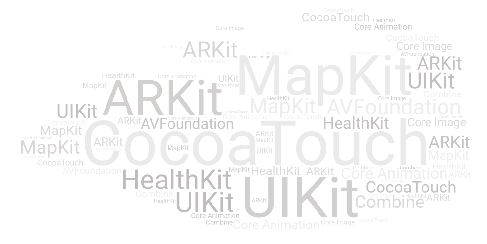

### 第1步：买一个Mac电脑并下载Xcode

首先，为自己准备一个MacOS系统(万一你还没有)。您的设备至少应该能够运行MacOS Catalina。然后下载来自AppStore的Xcode，它是免费的。Xcode是开发iOS应用程序最关键的软件！ 

### 第2步：了解Xcode的基本知识 

下载Xcode之后，是时候了解它的基本结构和概念了。检查本教程，以了解开始使用Xcode所需的所有知识。我们将建造我们的第一个迷你“你好世界”，帮助您决定使用UIKit和SwiftUI(iOS开发的两种不同方法)，并学习Xcode的基本界面。

### 第3步：学习SWIFT编程的基础知识 

在你了解了Xcode的基本知识之后，现在是学习Swift的时候了。Swift是最常用的编程语言，尤其对于初学者来说。我们已经为此创建了一个免费的电子书，您可以下载免费的！

### 第4步：通过教程构建Apps

开始用教程构建基本的应用程序，教程非常多！我们创建了一系列的SwiftUI教程让你开始从头学起！我们建议你先从本教程开始。之后，您可以继续学习这些教程。

虽然我们免费教程几乎涵盖了所有学习iOS开发需要了解的东西，你也许还想看看我们的全面掌握SwiftUI手册。在这本书中，我们将手把手的教你关于使用SwiftUI开发应用程序所需要知道的一切。

### 第5步：加深对IOS SDK和框架的了解 

一旦你完成了一些教程，在你感兴趣的话题上加深你的知识，你想学更多。在IOS开发中，有太多的框架需要掌握。例如，如果你对增强现实应用感兴趣，可以学习谷歌“ARKit教程”。你有很多选择！ 

### 第6步：加深你的Swift知识 

你对iOS应用程序开发了解的越多，就需要更多的Swift技能和概念。如果你不了解一些更高级的Swift概念，可以在官方网站上查一查Swift语言文档(这是一个非常好的来源)或在某个地方搜索或者提问，例如通过StackOverflow或给我们写条消息!

### 第7步：开发自己的定制应用程序 

要真正成为iOS开发人员，关键是要尽快开始开发自己的定制应用程序。这会极大地提高了你的学习曲线和编程技能。

