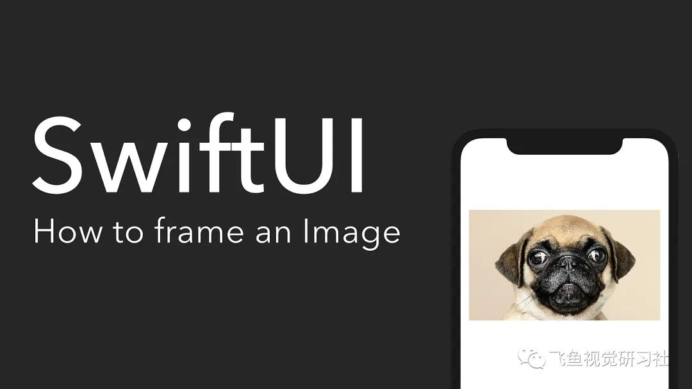

想知道如何在 SwiftUI 中正确地构建图像吗？这就是你要的！

第一步：将.resizable 修饰符应用于图像对象上，此修饰符将调整图像的大小和 frame 到合适的大小。

第二步：：当你改变图像的大小时，通常需要保持原来的尺寸。为此，添加.aspectRatio 修饰符。你可以选择.fill 内容模式，让整个 frame 被图像填满，而.fit 内容模式确保整个图像在 frame 内。

第三步：现在您可以声明图像的 frame 修饰符。

第四步：增加.clipped 修饰符，以确保你的图像超过 frame 的任何部分被切断。

```Swift
import SwiftUI
struct ContentView : View {
    var body: some View {
        Image("dog")
        //Enable size editing for the Image
        .resizable()
        //Define which method to use to keep the original dimensions when resizing
        .aspectRatio(contentMode: .fill)
        //Declare the frame for your image
        .frame(width: 380, height: 280)
        //Cut out the exceeding parts of the image
        .clipped()
    }
}
```
