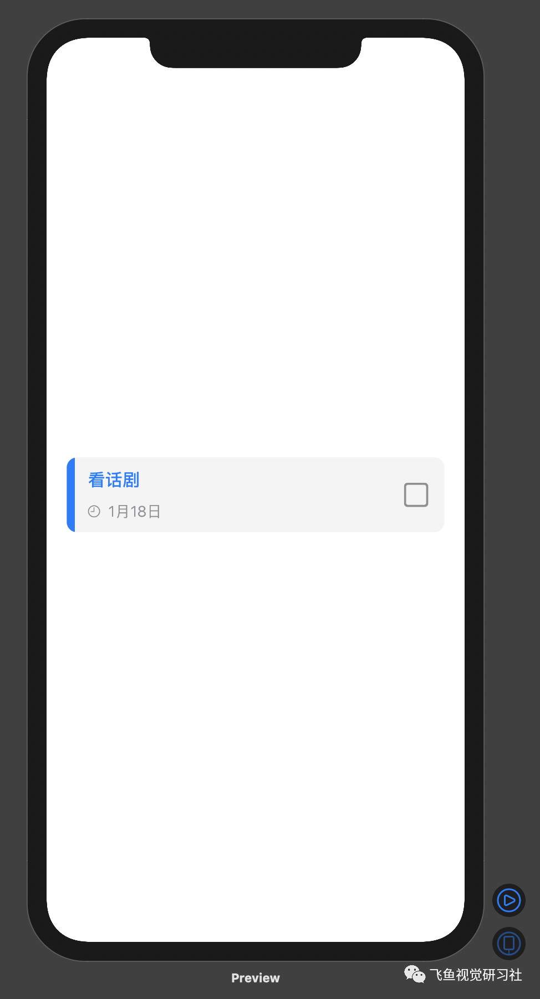

问题

创建一个如下图的待办事项视图。



思路

使用 SwiftUI 中的 HStack 和 VStack 来实现此视图，需要对扩张性控件和收缩性控件熟练把握。

解答

```Swift
HStack{
    Button(action: {})
    {
        //左边的部分，包括蓝边、项目标题及时间
        HStack{
            //蓝边
            VStack{
                Rectangle()
                    .fill(Color.blue)
                    //frame就是元素的大小
                    .frame(width: 8,height: 74)
            }
            //项目标题及时间
            VStack{
                //项目标题
                HStack{
                    Text("看话剧")
                        .font(.headline)
                    //把标题挤到左边
                    Spacer()
                }
                //时间
                HStack{
                    Image(systemName: "clock")
                        .resizable()
                        .frame(width: 12,height: 12)
                    Text("1月18日")
                    .font(.subheadline)
                    //不设置frame，无限大，把时间挤到左边
                    Spacer()
                }
                .foregroundColor(Color.gray)
            }
                //padding是元素和frame之间的边距
                .padding(.leading,5)
        }
    }
            Button(action: {})
            {
                VStack{
                    Image(systemName: "square")
                        .resizable()
                        .frame(width: 24, height: 24)
                        .foregroundColor(Color.gray)
                }
                .padding()
            }
        }
        .background(Color("SingleItemBg"))
        .cornerRadius(10)
        //元素内边距
        .padding(20)
```
