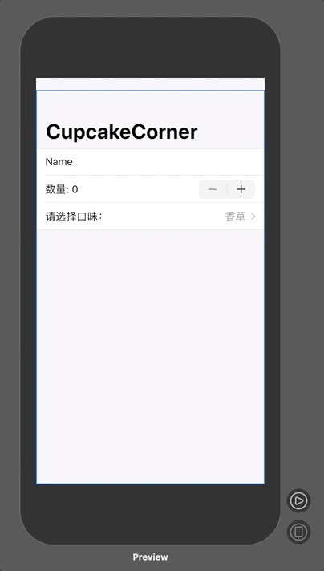

### 问题

使用 SwiftUI 制作开发如下图的点餐列表。



### 思路

使用 SwiftUI 中 TextField、Stepper、Picker 控件设计界面，结合自定义类数据将数据传入控件，完成开发。

### 解答（XCode11.4）

```swift
import SwiftUI

//ObservableObject使得Order成为被监听的对象

class Order : ObservableObject{
    //在添加ObservableObject协议的基础上，要改变值的变量必须加@Published
    let types : Array = ["香草","巧克力","芒果","草莓"]
    var type : Int = 0
    //@Published和@State的作用一样，当变量的值改变，视图中也会同步改变
    @Published var number : Int = 0
    @Published var text : String = "Name"
}

struct ContentView: View {
    //在结构体内容声明一个变量的类型为Order类，这样就可以用到外部的自定义数据类型
    @ObservedObject var order = Order()
    var body: some View{
        NavigationView{
            Form{
                TextField("name", text: $order.text)
                //Stepper是一个函数，其中的参数value必须要绑定一个值，rang给定一个范围.，访问变量值的时候不用加$，但是绑定，也就是改变的时候要加$，无论加不加$，它们的值都是一个值，所以这里前面加，后面不加。
                 Stepper("数量：\(order.number)", value: $order.number, in: 0…10)
                //selection表示已经选择的口味，
                Picker("请选择口味", selection: $order.type){
                // ForEach部分表示选择的范围，这其中的order.types只是将值传进去，而不会变化，因此不需要加$符号，从这里开始，是点击进入之后的内容
                    ForEach(0..<order.types.count){i in
                        Text(self.order.types[i])
                    }
                }
            }
            .navigationBarTitle("CupcakeCorner")
        }
    }
}

struct ContentView_Previews: PreviewProvider {
    static var previews: some View {
        ContentView()
    }
}
```
