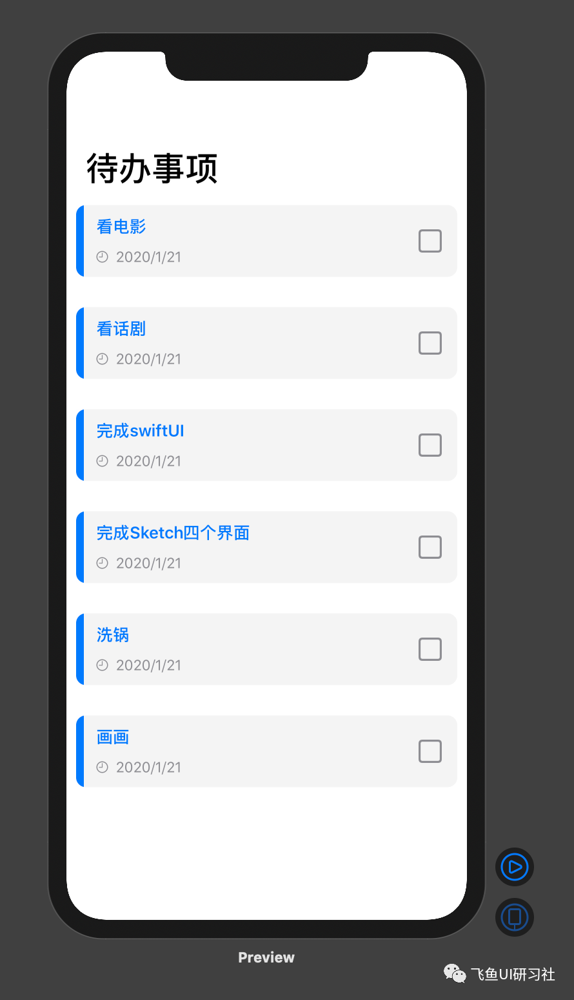

### 问题

创建如下图所示的待办事项列表视图，并将标题数据传递到待办事项中。



### 思路

每一项待办事项所包含的数据都是一样的，因此我们可以通过创建一个 class 类型的数据，其中包括字符串数据类型的标题、日期类型的时间和布尔值类型的选框，然后使用 SwiftUI 中的 ForEach 语句对数据进行遍历，从而完成数据的传递。

### 解答

```swift
import SwiftUI

//让类从NSObject, NSCoder继承功能，保证下次打开APP时，数据还在
class Todo : NSCoder{

    //每一个事项的标题
    var title : String = ""
    //每一个事项的日期
    var dueDate : Date = Date()
    //每一个事项是否打勾
    var checked : Bool = false
    //i用来记录某一待办事项是列表中的第几个待办事项
    var i : Int = 0

    init(title: String, dueDate: Date, checked: Bool){
        //self.title代表类里面的title等于初始化函数里的参数title，如果这样写就好理解很多：
        //self.title = a
        self.title = title
        self.dueDate = dueDate
        self.checked = false
    }
}

//var emptyTodo : Todo = Todo(title: "", dueDate: Date())

var exampleTodos: [Todo] = [
    Todo(title: "看电影", dueDate: Date(), checked: false),
    Todo(title: "看话剧", dueDate: Date(), checked: false),
    Todo(title: "完成swiftUI", dueDate: Date(), checked: false),
    Todo(title: "完成Sketch四个界面", dueDate: Date(), checked: false),
    Todo(title: "洗锅", dueDate: Date(), checked: false),
    Todo(title: "画画", dueDate: Date(), checked: false)
]

NavigationView{
            ScrollView{
                ForEach(0..<exampleTodos.count){todoIndex in
                    VStack{
                        HStack{
                            Button(action: {

                            })
                            {
                                //左边的部分，包括蓝边、项目标题及时间
                                HStack{
                                    //蓝边
                                    VStack{
                                        Rectangle()
                                            .fill(Color.blue)
                                            //frame就是元素的大小
                                            .frame(width: 8,height: 74)
                                    }

                                    //项目标题及时间
                                    VStack{

                                        //项目标题
                                        HStack{
                                            Text(exampleTodos[todoIndex].title)
                                                .font(.headline)
                                            .foregroundColor(exampleTodos[todoIndex].checked ? .gray : .blue)
                                            //把标题挤到左边
                                            Spacer()
                                        }
                                        //时间
                                        HStack{
                                            Image(systemName: "clock")
                                                .resizable()
                                                .frame(width: 12,height: 12)
                                            Text("2020/1/21")
                                                .font(.subheadline)
                                            //不设置frame，无限大，把时间挤到左边
                                            Spacer()
                                        }
                                        .foregroundColor(Color.gray)
                                    }
                                        //padding是元素和frame之间的边距
                                        .padding(.leading,5)

                                }

                            }
                            Button(action: {

                            })
                            {
                                VStack{
                                    Image(systemName: exampleTodos[todoIndex].checked ? "checkmark.square" : "square")
                                        .resizable()
                                        .frame(width: 24, height: 24)
                                        .foregroundColor(Color.gray)
                                        .animation(.easeInOut)
                                }
                                .padding()
                            }

                        }
                        //冒号前面表示checked为真时的背景色，后面为否时的背景色
                            .background(Color(exampleTodos[todoIndex].checked ? "SingleItemBgChecked" : "SingleItemBg"))
                        .cornerRadius(10)
                        //元素内边距
                        .padding(10)
                    }
                }
            }
        .navigationBarTitle("待办事项")
        }
```
