好的 Logo 设计最重要的方面不是看视觉上多么漂亮，而在于在表意上是否足够准确和直接。准确要求抓住产品和概念的特点进行抽象和提取，而直接则要求以简单直白的方式表达，要让人能看得懂，起码稍动脑筋就能明白。

就拿下图苹果的三个应用程序的图标举例来说，这三个图标视觉上看来都非常漂亮，细节很丰富，拟真感很强，但如果从表意的角度上来看的话，Numbers 的设计要优于其它的两个图标设计。虽然其他两个图标在概念上也基本抓住了应用程序的功能诉求，但还略显模糊，尤其是 Pages 墨水和钢笔的设计。

当然，虽然我们强调第一位的表意上的准确，但是视觉上的准确和美观也并非可有可无。这篇文章里，我收集了 33 个以圆形为基础的 logo 设计，虽然并非全部了解其中所表达的含义，但是起码在视觉设计上能给大家以启发和帮助，让我们看到如何在以圆形的基础上进行 Logo 的设计创作。

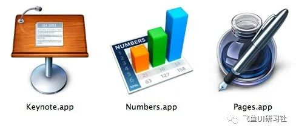

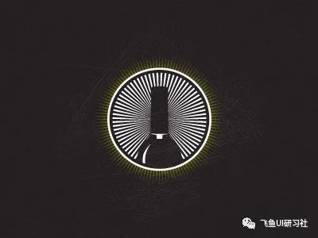

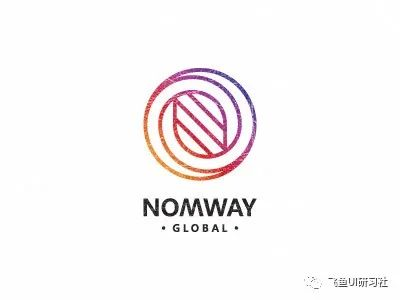

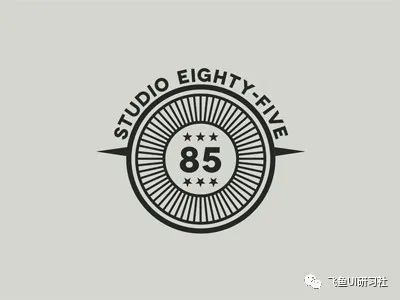

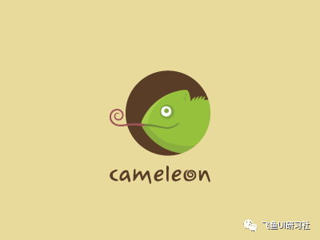

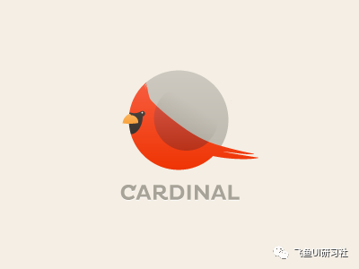

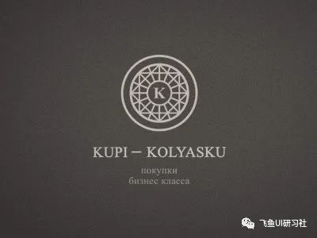

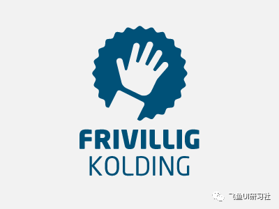

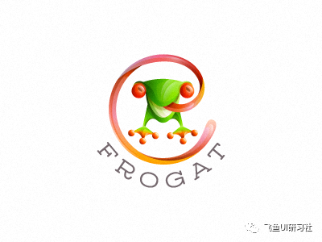

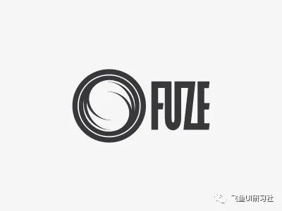

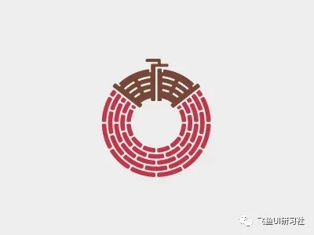

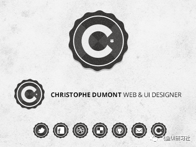

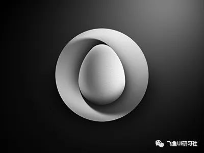

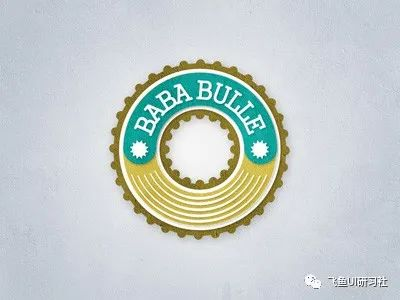

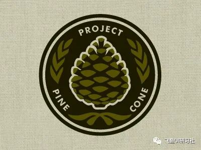

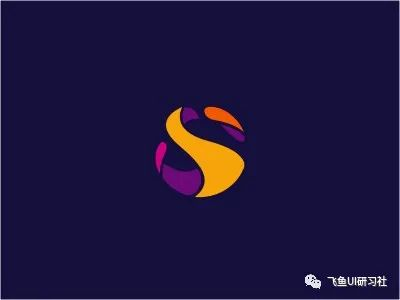

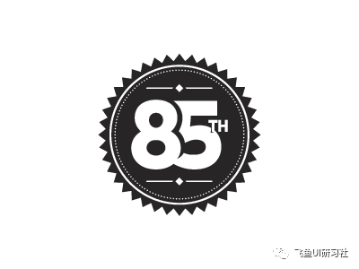

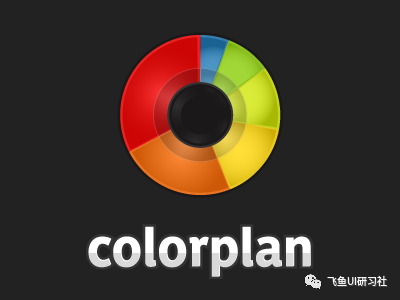

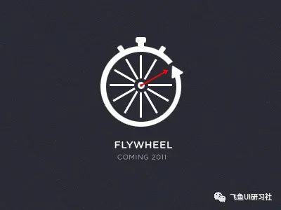

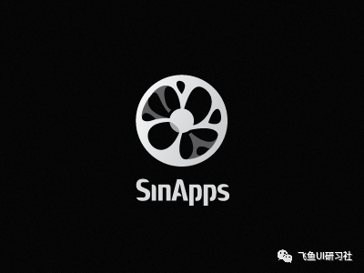

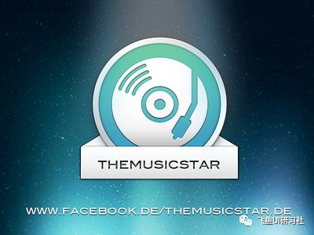

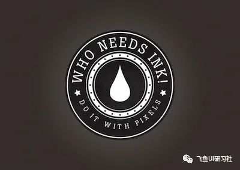

