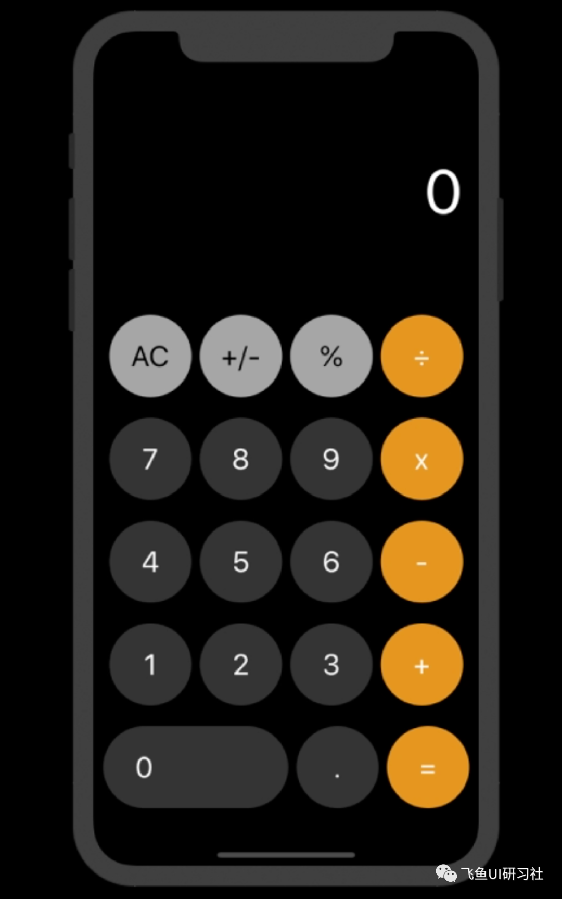
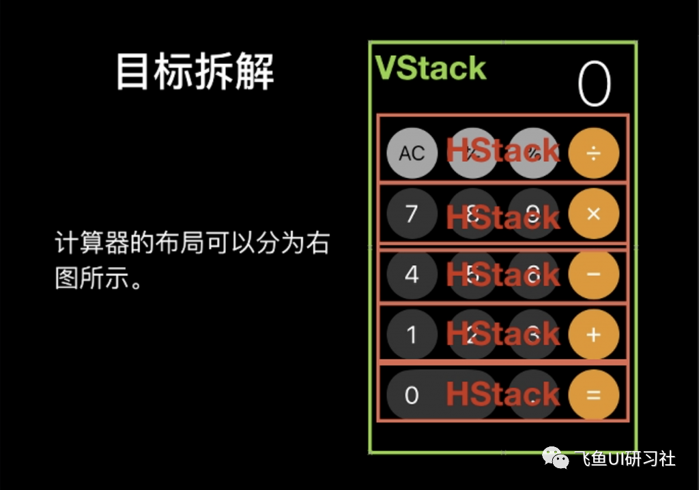

### 问题

使用 HStack 和 VStack 来实现计算器的界面。



### 思路

任何复杂的界面都可以将其分解为单一的 HStack 和 VStack 来实现，计算器界面也一样，先用 HStack 将横排的按钮组合，然后再将 HStack 放入到 VStack 中。



步骤一：按照界面元素从上到下的顺序开始写起，使用 HStack 和 VStack 组织好界面。

步骤二：通过创建自定义视图 View 和自定义 ViewModifier 将重复的控件（Text()）和修饰符合并，简化代码。其中计算器数字部分“0”的样式，通过在 ViewModifier 中设置布尔值加三元运算符的方法来实现。

步骤三：由于自定义的 ViewModifier 有三种，分别对应计算器按钮的三种不同样式，还需要进一步合并，接下来使用双重数组加 ForEach 语句，并通过定义枚举数据类型将计算器按钮数据归类来完成合并。

### 解答

```swift
import SwiftUI

//计算器界面的主视图。
struct ContentView: View {
    var body: some View {
        VStack(spacing : 20){
            Text("0")
                .frame(maxWidth: .infinity, maxHeight: 200, alignment: .trailing)
                .padding(.trailing, 50)
                 //系统自带的文字大小
                .font(.system(size: 60))
                .foregroundColor(Color("resule_fg"))
            ForEach(0..<calcu_text.count){ i in
                HStack{
                    ForEach(0..<calcu_text[i].count){ j in
                        CustomButton(calcu_text[i][j])
                //这里是每个按钮的视图。
                    }
                }
            }
        }
        .frame(maxWidth: .infinity, maxHeight: .infinity)
            .background(Color("calc_bg"))
            //注意顺序
            .edgesIgnoringSafeArea(.all)
    }
}


//使用View协议，生成一个CustomButton复合视图，这个视图生成了每个按钮的内容和样式。
struct CustomButton : View {

    let type : CalcButtonType

    init(_ type : CalcButtonType) {
        self.type = type
    }

    var body: some View{

        Text(self.type.text)
            .modifier(CalcModifier(type:self.type))

    }
}


//使用View协议，生成一个CalcModifier复合修饰符来修饰每个按钮。
struct CalcModifier : ViewModifier {

    let type : CalcButtonType
    //让结构体的类型为枚举型

    func body(content: Content) -> some View {
        content
            .frame(width: 80,height: 80)
            .font(.title)
            .background(self.type.bg_color)
            //从固定的样式，变为动态样式
            .foregroundColor(self.type.fg_color)
            .cornerRadius(40.0)
    }
}


//使用枚举类型数据，对复合修饰符和内容进行操作。
enum CalcButtonType{
//因为要给按钮设置三种样式，那么将之前数组类型的数据定义为枚举型，更方便使用。

    case number(_ text:String)
    //number是枚举的成员，关联值是一个字符串类型
    case calc_opterator(_ text:String)
    case calc_s_opterator(_ text:String)

    var text : String {
    //定义一个属性，这个属性直接返回text.

        switch self {
        case let.number(text) :
            return text
        case let.calc_opterator(text) :
            return text
        case let.calc_s_opterator(text) :
            return text

        }

    }

    var fg_color : Color{

        switch self {
        case .number(_) :
        //如果匹配number，那么返回Color("darkgrey_operator_fg")
            return Color("darkgrey_operator_fg")
        case .calc_opterator(_) :
            return Color("yellow_operator_fg")
        case .calc_s_opterator(_) :
            return Color("s_operator_fg")

        }

    }

    var bg_color : Color{

        switch self {
        case .number(_) :
            return Color("darkgrey_operator_bg")
        case .calc_opterator(_) :
            return Color("yellow_operator_bg")
        case .calc_s_opterator(_) :
            return Color("s_operator_bg")

        }

    }

}

prefix operator %
prefix operator -
prefix operator +

prefix func % (right : String) -> CalcButtonType{
    return .calc_s_opterator(right)

}
prefix func - (right : String) -> CalcButtonType{
    return .calc_opterator(right)

}
prefix func + (right : String) -> CalcButtonType{
    return .number(right)

}
//将数据定义为枚举类型。
let calcu_text : [[CalcButtonType]] = [[%"AC",%"+/-",%"%",-"+"],[+"7",+"8",+"9",-"x"],[+"4",+"5",+"6",-"2"],[+"AC",+"+/-",+"%",-"2"],[+"0",+"+/-",-"="]]


struct ContentView_Previews: PreviewProvider {
    static var previews: some View {
        ContentView()
    }
}
```
