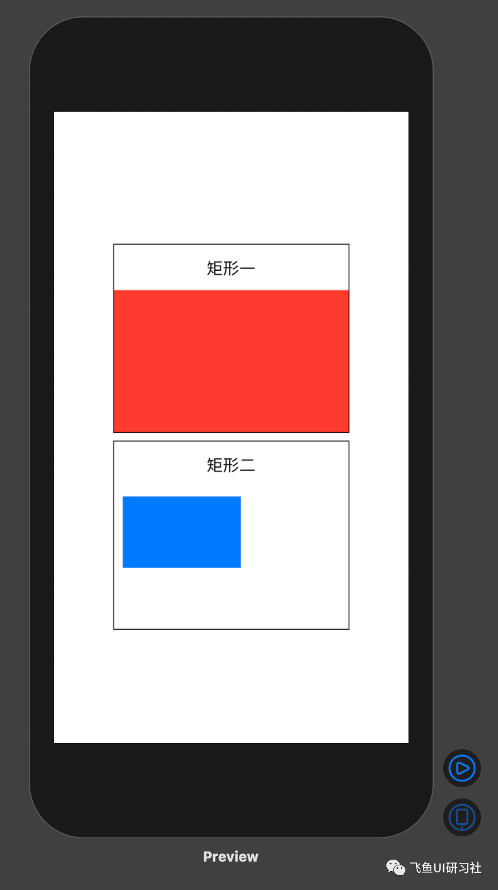

### 问题

如下图：有两个 VStack 容器，高和宽分别为 100 和 150，容器的上方是文字标题，标题下方分别有一个红色矩形和一个蓝色矩形，请用红色矩形将标题下方的容器填满，将蓝色矩形的高宽设置为容器的二分之一，放在距容器左侧 10 个单位，距顶部 10 个单位的位置。



### 思路

使用 GeometryReader 读取父容器的尺寸，依此来定位矩形的位置。

### 解答

```Swift
struct ContentView: View {
    var body: some View {
        VStack{
            VStack {
                Text("矩形一")
                    .padding(.top)
                Rectangle()
                    .fill(Color.red)
            }
            .frame(width:250,height: 200)
            .border(Color.black)
            VStack{
                Text("矩形二")
                    .padding(.top)
                //GeometryReader会读取父容器的尺寸，然后根据父容器的尺寸设置矩形的大小及位置
                GeometryReader{geometry in
                    Rectangle()
                        .path(in: CGRect(
                            x: 10, y: 10, width: geometry.size.width/2, height: geometry.size.height/2
                            )
                    )
                        .fill(Color.blue)
                }
            }
            .frame(width:250,height: 200)
            .border(Color.black)
        }
    }
}
```
