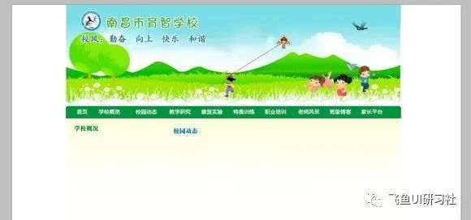
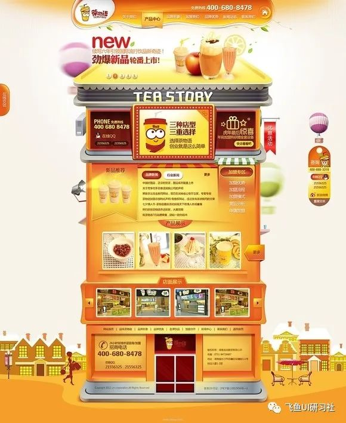
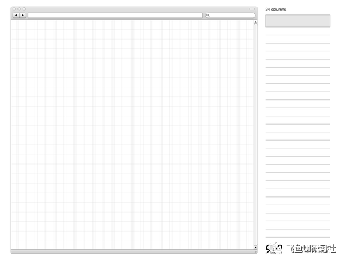
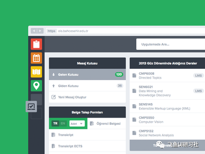
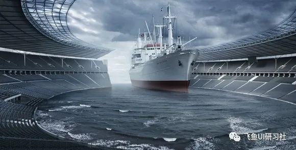
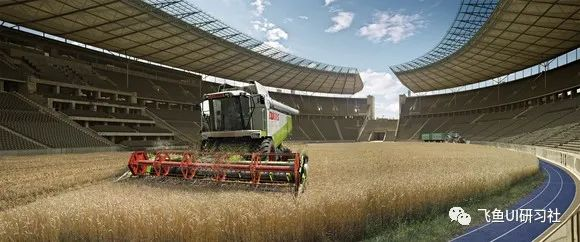

从和客户沟通了解客户需求到画出草图进行构思和创意，直至打开Photoshop完成整个的设计，每一个网页设计师都在每一个新的设计项目中不断重复这个过程。整个看上去规范而流程化的工作方式似乎按部就班就能够顺利拿到让大家都满意的结果，但其实在每一个步骤中都存在难度，某一个方面没有做好，可能就会影响到最终设计稿的质量。因此在这篇文章中我就来结合自己的设计体会谈谈这其中存在的常见问题，以及我们应该如何有意识的避免或者解决它们。

这篇文章中的内容我已经在SDC的网页设计讲座中和大家谈到，这次算是对整个讲座内容的总结和归纳。关于网页设计中的问题，我总结了个人认为常见的六个，下面一一道来。

### 问题一 ：和客户沟通的不够充分，导致设计方向出现偏差。

这个问题是在设计流程中出现最多，也最容易导致客户和设计师产生矛盾的问题。最终的结果是客户觉得怎么修改设计都不能让自己满意，而设计师却不胜其烦，认为客户太难说话，原因其实就出在双方的沟通上。

作为客户来说，很多时候他们对于期望的设计产品脑子里往往只有模糊的概念，只能交代给设计师一个过于粗略的设计方向，甚至有些客户提出"先做一稿出来我再看"的要求。遇到这种情况，设计师要清楚客户自己的设计需求是不明晰的，而作为设计师来说，这时就需要积极地引导客户，使他们明晰设计需求，从而避免由于双方未在设计目标和期许上达成一致，造成设计方向上出现偏差，而导致设计中大范围、不断的修改设计稿，甚至一遍一遍的推倒重来的结果。

要使双方对最终的设计都满意，就需要尽可能详细的沟通，客户和设计师之间理解程度越高，最后达成的一致性也越高，这两者是呈正相关的关系。要做到这一点，我个人的方法是在沟通的环节设计系统的调查问卷让客户作答，以帮助客户梳理、明晰设计需求。下面是我经常使用的调查问卷内容，其中需要客户作答7个问题，这些问题基本可以帮助客户和设计师明确设计方向，你也可以依据在和客户沟通中的具体情况修改或者完善这些问题。

当访问者访问你的网站的时候，你希望它们做什么？（比如购买某种产品、服务，或者展示企业的形象等）

网站的主体用户是哪部分人群？（白领年轻女性、有某方面需求的老年人等）

网站的整体风格是什么？当访问者进入你的网站，你希望他们有什么感觉？不希望他们有什么感觉？

举几个你喜欢的网站，并说明原因；例举几个你讨厌的网站，也说明原因。（请将网站链接或者截图粘贴在下方）

网站栏目有哪些？并提供具体信息内容（可粘贴在下方）

请提供网站设计的资料，包括logo，公司图片，产品图片等（打包以附件形式发送至设计师邮箱）

请提供您的联系方式。（QQ、手机或者邮箱）

### 问题二：跳过网站功能及信息架构上的研究，直接开始视觉创作。

网站的功能和信息架构是网站的核心，一个网站不是单纯的让访问者去感受视觉上的美观，美观永远是第二位的，而功能性却是第一位的。一个企业网站是为了展示企业的形象、售卖企业的产品和服务；一个门户网站是为了更好的提供信息内容，一个个人博客是为了分享个人的观点，树立个人品牌等等，保证了这些功能更好的实现了之后才应该去考虑视觉上是否美观的问题。

我在之前的一篇文章《从千鸟志看网页设计中的功能性》中分析过千鸟的个人博客在功能性和用户体验方面的优点，虽然初次打开该博客并不会被它看上去似乎没怎么设计的灰白界面所吸引，但这个网站良好的用户体验却一定会让你记忆深刻。

更重要的是，网站功能以及它的信息架构对于视觉是有非常重要的影响的，这点我在《网页核心内容对视觉表现的影响》这篇文章中有较为详细的论述，在这里就不再展开了。

### 问题三：缺乏对网站整体风格的思考和把握，做到哪里算哪里。

这个问题也非常常见，以下是一个设计师发给我的问题及我的答复，应该说非常典型的反映了这个问题。

"想请教你一下，一个学校的网站，客户说要做活泼一点，怎么搞呀？我设计了一个头部，我发给你看一下啊！指点一下 但是下面我就不知道怎么布局了，现在头都想大了。"

答复：这是一个没有系统的考虑整体风格而急于动手的例子。问题主要由以下几个方面：

一、布局上，Banner割裂的边缘限制了视线的拓展，显得死板而不够透气。其他元素也是大框套小框的思路。总体的布局思路没有逃脱条条框框的限制，看得出来，整个设计是思路没有打开却急于动手的表现。要做到活泼的设计，不是用一张现成的关于儿童的图片放上去就行了，要让各个设计元素往这个方向走，比如布局，比如色彩，比如质感，比如插图和图标的使用，比如字体的选择等等，所以你的问题是完全没有系统的思考这些问题，还没找到答案就急于往前走，结果肯定是刚刚开始就感觉无所适从。

二、再来说说具体的问题，Banner的设计在整个页面中通常起到非常重要的作用，是视觉的焦点，先不说你选的这个图片方向对不对，但这个设计看上去过于小气，原因是图片中的元素视觉比重都差不多，没有重点，没有主次。其次是Logo文字以及宣传语文字的设计，感觉太散、太单薄，需要加强他们的视觉比重和气氛感受。Banner底部的弧形边缘不仅没有起到给整个气氛加分的效果，反而割裂了Banner的设计，看上去很不美观。

如何避免盲目开始，途中无从下手的问题出现？很简单，画草图。虽然我个人有时候也会省略画图的步骤，但每次至少会在 PS 中做一个主页的设计方案，其中包括需要放置的信息内容、排版、色彩方案以及设计方案的说明文字。但我发现相较于纸和笔来说，这样的方式还是限制了创意的拓展。所以还是强烈建议大家在开始设计之前画草图。很难想象，不通过画草图的方式能做出来下面的设计效果。

但是纸和笔的方式也有它的缺陷就是在设计排版方面不能精确的定位元素的空间。所以为了弥补这个缺憾，建议大家使用960像素网格系统的草图稿纸。纸和笔的自由保证了创意的拓展，而不用纠缠于实现方面的技术问题。

另外，在平时的学习积累中，多从整体风格上分析优秀的设计作品是如何考虑和实现的，可以尝试从以下几个方面分析网站风格：一、概念元素：背景、修饰图形等；二、具象元素：文字、照片、插图、图标图形；三、关系元素：方向、位置、空间、重心；四、交互方式：节奏、运动方式；五、色彩方案。

### 问题四 ：设计过程中遇到困难，随意调整设计方向。

画好了草图就要按照设计方向坚决执行，这样才能保证前期的创意阶段的工作不被浪费。很多设计师前期的创意构思都很有想法，但是一旦开始设计，途中遇到寻找素材或者技术方面的困难，或者突然发现某一个素材很不错，很漂亮，马上抛弃前面的整个创意，开辟一条新路从头开始，但往往做到半中间就再做不下去了，导致设计总是半途而废，情绪上不断受挫，焦躁不堪。而我们如果看过高手的设计过程，比如文子的光大银行的设计视频，我们就会发现高手从来都不轻易的改变已经设定好的设计方向，并且总能把我们看来完全用不着的素材变废为宝，从而拥有化腐朽为神奇的本事。千万不要花费大量时间去寻找完美的、拿来不用调整就能用的设计素材，能找到这样的素材的几率比中彩票还要低，而是要不断提高我们将看上去和整体设计毫不搭边的素材融合进整体设计的能力。

### 问题五 ：细节不够讲究，显得粗糙。

一些设计师给我发来个人作品让我给说说建议，我发现其中共同存在的问题就是设计中细节做的不好。渐变和高光过于生硬、阴影的距离和不透明度太高、对齐方式偏差几个像素、上下左右边距距离太小、元素和背景的反差不够造成元素清晰度不够等几个问题是常见的设计毛病。这些问题虽然也涉及到技术的问题，但是最重要的我认为还是用心不够、认为做到差不多就行了的态度问题。这里我向大家推荐Dribbble 和PremiumPixels这两个网站，这其中的设计作品无论哪一个细节都是非常完美、无可挑剔的，下面是我随手从这两个网站中拿出来的作品，大家应该能从这里理解网页设计就是细节的艺术这句话的含义。

### 问题六 ：技术不过关，创意无法得到实现。

这个无需多说，只有通过大量的设计和练习才能尽可能多的掌握具体的技术。但是无论是跟着网上的设计教程学习，还是通过研究别人的PSD文件也好，不能做过一遍就过去了，拿我之前翻译的《在photoshop中制作一个飘浮于空中的茂盛的"树屋"》这篇文章来说，你需要通过这篇教程掌握的是如何处理手头的素材，将其融合于整体的场景之中的思路的方法，看看高手是如何通过使用调整图层、自由变换、色彩范围选择等一系列的技术去实现需要的效果，而不仅仅是按照教程做一遍就完了，下次遇到需要自己动手创建场景的时候依然无所适从。如果你已经有了一定的PS基础，我建议多练习些图标和场景的创建，例如下面这个精致的西红柿图标和几个场景的创建，认真研究，你一定能学到很多东西。

