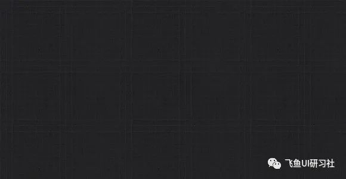
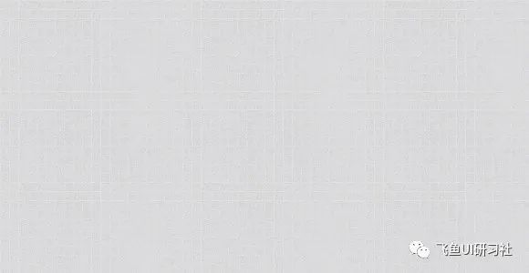
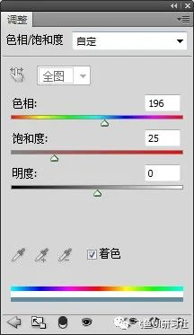
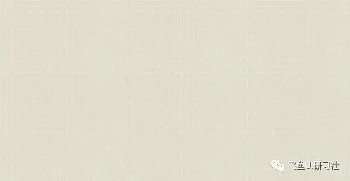
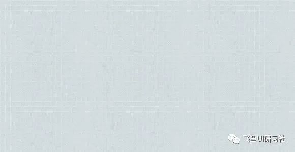
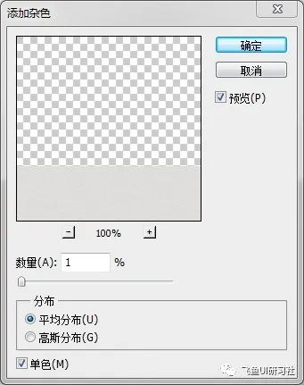
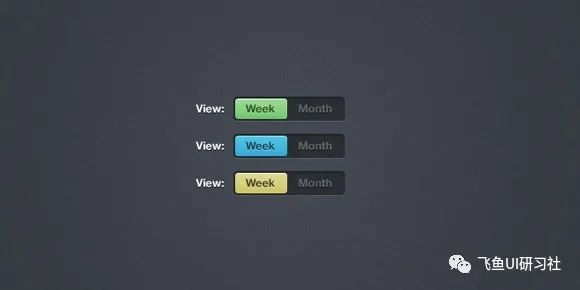
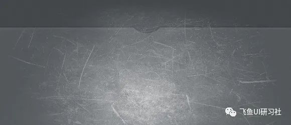
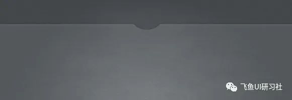
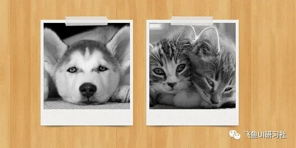

在网页设计中创建背景材质通常是根据设计方向展开设计的第一步，也是确定设计基调的重要环节。虽然大多数情况下，网页背景材质是非常细微和低调的，但是由于整个背景的范围较大，所以会给人强烈的心理感受。所以这篇文章中，我会就网页背景材质创建过程中常用到的方法做一总结，希望对于大家在设计中的开头步骤能够给与帮助的参考。

### 一、使用现成的图案来创建网页背景材质。

1、下载现成的图案样式，或者自己动手创建图案，关于如何自己创建图案，之前我写的一篇文章《在 Photoshop 中创建多种样式的网格背景图案》以及《在 Photoshop 中创建不规则无缝拼接图案》可以作为参考。下载完或者创建好图案之后，在图层样式中选择图案叠加即可。虽然看起来是很简单的一个步骤，但是如果有了高质量的图案样式，效果非常显著。下面是我收集的一些经典的图案文件，其中包括五类图案样式。

2、如果下载的图案色调不符合设计要求的话，可以通过图层混合模式来进行调整。比如我们想要创建浅色的背景材质，但是手头的图案样式是暗色的，如果图案叠加的混合模式为正常的话，创建出来的效果如下图：

但是我想用这款图案做出浅色的背景来，该怎么做呢？这时候就可以通过调整图案叠加的混合模式来实现。在背景色不完全是白色的情况下，一般像上面的图案，通过调整混合模式到亮光就能得到如下图的效果。

3、还不满意的话，比如想要亮度再稍微再亮一点，还可以通过新建调整图层来实现。在这个例子中，使用色阶调整图层就可以实现我们的设计目标。你还可以通过添加黑白图层来给整个背景材质去色，通过色相饱和度图层调整背景材质的色相以及明暗值。

4、通过在图案图层上方新建一个颜色填充图层，调整该图层的图层混合模式，我们可以给图案图层添加一定的颜色。比如加一点黄色进去，或者加一点蓝色。当然这里我们依然可以通过添加色相以及饱和度调整图层来给本来是灰度的材质上色，具体方法就是在色相饱和度调整图层的对话框中勾选着色框，然后调整色相的滑动块来实现。

《在 Photoshop 中创建一个布纹材质的网页》可以作为这种方法的参考教程。

### 二、应用滤镜来创建网页材质背景。

在使用滤镜来给网页背景添加材质的方法中，最常见到的莫过于使用滤镜中的添加杂色命令来实现需要的效果了。应用步骤为，先将图层转转为智能对象，目的是方便随时调整滤镜值。然后应用滤镜>杂色>添加杂色命令即可，非常简单。一般来说，添加杂色时，滤镜数值的设置非常低，一般使用 1%就够了，而且效果非常好，数值太大材质看上去不够自然。具体设置如下图所示：

杂色背景效果如下图：

### 三、使用笔刷来添加质感。

使用笔刷来创建网页背景材质也很简单，一般的步骤是，将前景色调整为白色，选择画笔工具，调整好大小，在新建的图层上随机添加一些笔刷效果，通过多建几个图层，调整不同图层的图透明度可以让添加的材质看上去更自然和真实。之后将图层的混合模式调整为叠加或者柔光让笔刷效果和背景更好的融合。下面的图片是添加了划痕和做旧效果的笔刷后，未更改图层混合模式之前和更改后的效果：

除了上面的做旧风格常用到这种方法外，笔刷方法的应用还常常出现在水彩风格的网页设计过程中，下面的这两个设计教程充分展示了笔刷在创建背景材质中的方法。

《在 Photoshop 中创建一个水彩风格的网页设计》

《创建一个做旧的，半透明的个人网页》

### 四、使用材质图片来创建网页背景

比如我们要让网页背景看上去是纸质的感觉。当然可以通过添加不同层次的滤镜效果模拟来实现类似于纸张的材质，但是相较于直接把一张纸质材质的图片拖到文档中，通过调整图层的混合模式以及上面提到的各种调整图层来实现的话，后面的一种方法做出来的效果往往要更真实和自然。类似的还有木质的背景材质的实现。《在 Photoshop 中创建一个游戏界面窗口》这篇文章很好的阐释了这种背景材质设计方法以及上面几种方法的综合运用。

下面的截图展示了木质背景材质的效果：

### 五、总结

实际上，在创建网页背景材质时，上面讲到的方法都会涉及到，只不过依据设计目标，有时只会用到其中的一种方法，比如杂色背景的话，应用添加杂色的滤镜命令往往就够了，有时却要复杂一些，可能上面的方法都会用得到。所以我们要依据总的设计目标来选择性的使用，但是这些方法不用说都是网页设计中必须要掌握的，这样我们的设计手法才能灵活多变。
