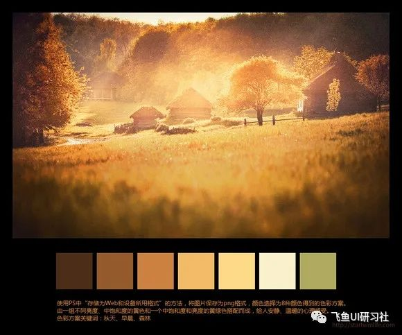
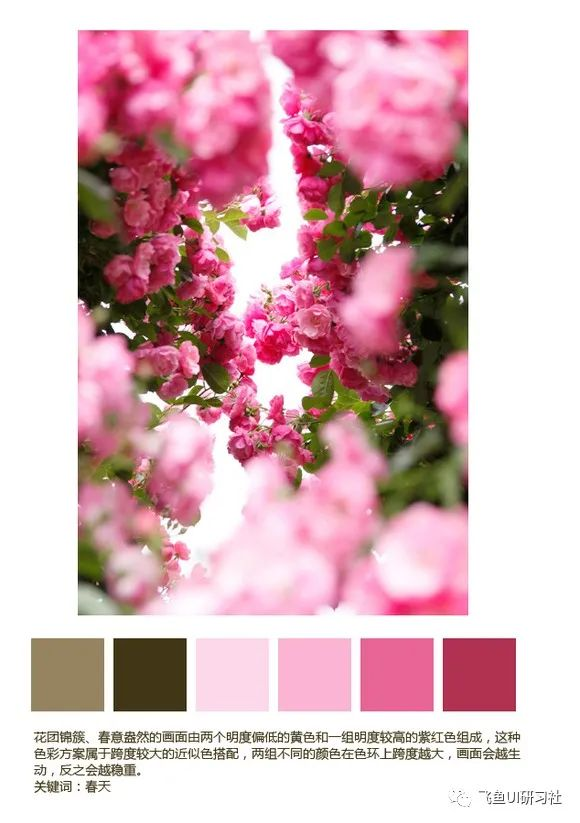
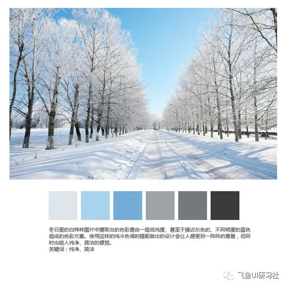
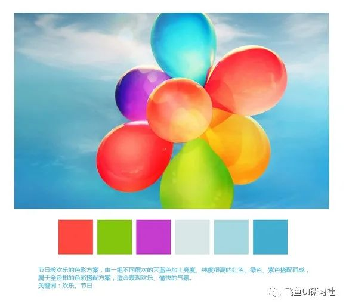
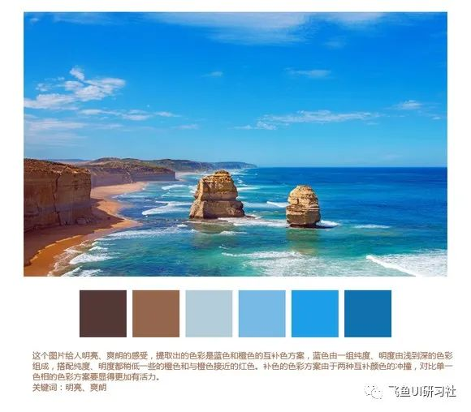
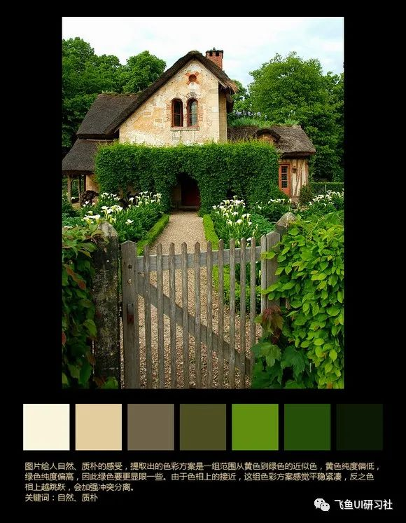
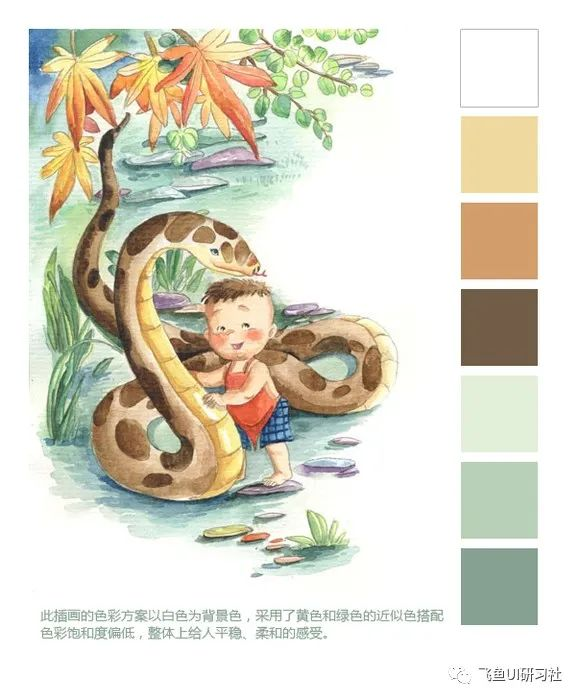
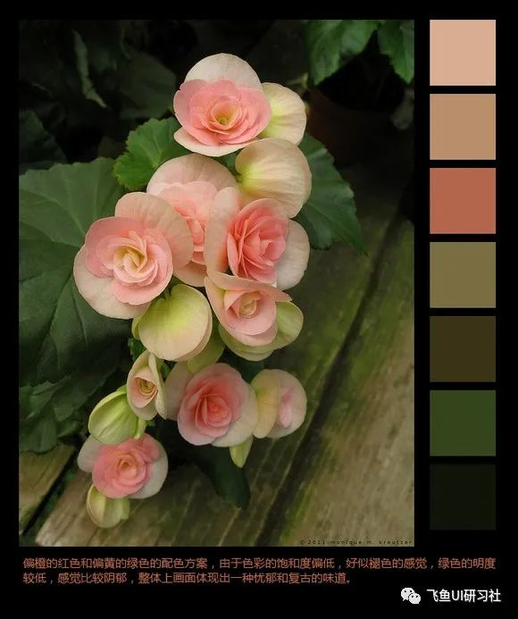
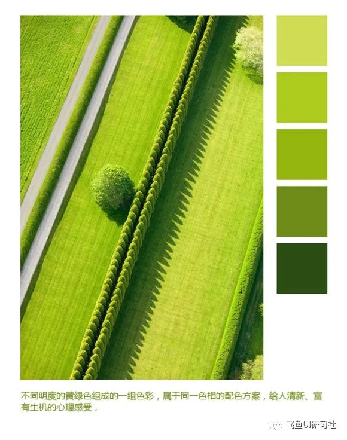

每一张图片的色彩都有自己独特的个性，即使是表现同样主题的两张图片，比如秋日里森林的早晨，虽然可能都是偏褐色色调的，但色相、纯度、明度、搭配方法还是会有很大的不同，而这正是设计中从图片中提取色彩方案的魅力所在。如果将这些色彩应用到设计中的话，那每一个设计都可以做到绝对的个性化，起码在配色方面如此。因此在这篇文章中，我挑选了10张情绪上不同的图片，提取出它们的色彩方案，并进行分析，希望对于大家在配色方面有所帮助。

### 一、安静、温暖

使用PS中"存储为Web和设备所用格式"的方法，将图片保存为png格式，颜色选择为8种颜色得到的色彩方案。由一组不同亮度、中饱和度的黄色和一个中饱和度和亮度的黄绿色搭配而成，给人安静、温暖的心理感受。

### 二、柔美、春天、女性

花团锦簇、春意盎然的画面由两个明度偏低的黄色和一组明度较高的紫红色组成，这种色彩方案属于跨度较大的近似色搭配，两组不同的颜色在色环上跨度越大，画面会越生动，反之会越稳重。

### 三、纯净、简洁

冬日里的白桦林图片中提取出的色彩是由一组低纯度、甚至于接近灰色的、不同明度的蓝色组成的色彩方案。使用这样的纯冷色调的搭配做出的设计会让人感受到一阵阵的寒意，但同时也给人纯净、简洁的感觉。

### 四、欢乐、节日

节日般欢乐的色彩方案，由一组不同层次的天蓝色加上亮度、纯度很高的红色、绿色、紫色搭配而成，属于全色相的色彩搭配方案，适合表现欢乐、愉快的气氛。

### 五、明亮、爽朗

这个图片给人明亮、爽朗的感受，提取出的色彩是蓝色和橙色的互补色方案，蓝色由一组纯度、明度由浅到深的色彩组成，搭配纯度、明度都稍低一些的橙色和与橙色接近的红色。补色的色彩方案由于两种互补颜色的冲撞，对比单一色相的色彩方案要显得更加有活力。

### 六、自然、质朴

图片给人自然、质朴的感受，提取出的色彩方案是一组范围从黄色到绿色的近似色，黄色纯度偏低，绿色纯度偏高，因此绿色要更显眼一些。由于色相上的接近，这组色彩方案感觉平稳紧凑，反之色相上越跳跃，会加强冲突分离。

### 七、安静、神秘

即将坠入黑夜的湖面景色透露出安静、神秘的气氛。一组不同明度的紫色、一组不同明度的红色加上一个浓浓的黑色构成了这幅图片的配色方案，值得注意的是，无论是哪种色彩，在自然界中很少有100%纯度的，就像这张图片一样，色彩的纯度都在中间甚至偏低一点的范围内，这也正是为什么过高纯度的色彩我们会觉得不舒服的原因。

### 八、平稳、柔和

此插画的色彩方案以白色为背景色，采用了黄色和绿色的近似色搭配，色彩饱和度偏低，整体上给人平稳、柔和的感受。

### 九、忧郁、复古

偏橙的红色和偏黄的绿色的配色方案，由于色彩的饱和度偏低，好似褪色的感觉，绿色的明度较低，感觉比较阴郁，整体上画面体现出一种忧郁和复古的味道。

### 十、清新、富有生机

不同明度的黄绿色组成的一组色彩，属于同一色相的配色方案，给人清新、富有生机的心理感受。

