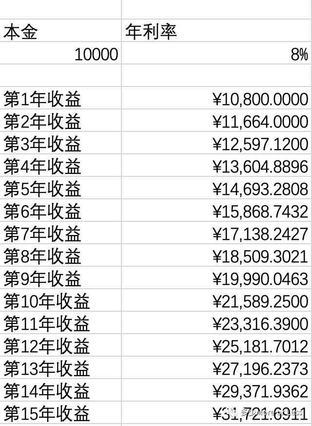
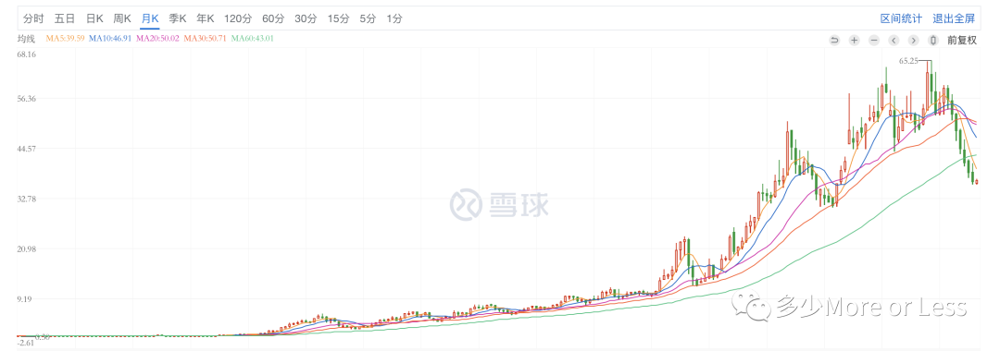
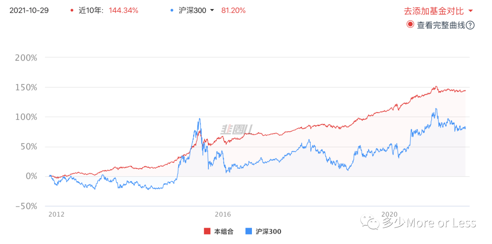

美国普林斯顿大学经济学教授马尔基尔曾说过，绝大多数人这一生犯的最大错误就是没有充分利用复利。

什么是复利？简单地说就是利滚利。也就是上一年（或任何计息周期）的本金所产生的利息计入到下一年度的本金之内再计算利息。这样的计息方式威力巨大。相信我们大部分人都听说过背上了被称之为“驴打滚”的高利贷无法摆脱债务的故事。这里俗称的所谓“驴打滚”的高利贷，其实就是复利。复利的力量在于随着时间的推移，收益或者债务会越来越多，呈几何数的增长。

我们举个简单的例子来直观的感受复利的力量。如下图所示，假设你有1万元本金，按照复利年化收益8%计算，那么在第9年的时候本金就可以翻倍。而越往后，增长的幅度越来越大。到第15年，本金就可以增长超过200%。

关于计算翻倍增长，我们通常使用更简单的七二法则。也就是用72除以复利年化收益来计算本金翻倍所需要的时间。同样也可以用时间长度来推算每年的收益率，比如打算用10年时间让本金翻倍，那么就用72÷10，那么你需要在这10年中保持年化收益7.2%。

我们可以用这个公式来计算一下近10年房产的年化收益。假设一套100平米的房子，10年前房子的单价是5000元每平米，10年后上涨到18,000元每平米，房子的总价从50万元增长到180万元。那么按照复利计算的话，年化收益接近14%。这个收益率已经跑赢了市场指数的平均收益，按照复利计算下来，我们就能很明显的看到，房子就是近二十年中收益最好的投资产品。可以这么说，在中国房地产市场飞速发展的这二十多年中，我们每个普通人多多少少都主动或被动的参与了一场关于复利的投资活动。

但目前来看，显然这场活动已经进入下半场。房地产投资这条已经到后半段的鱼，也许还有肉吃，但被刺扎到的概率也在不断增加，是时候将目光转回到资本市场了。在经历了19年和20年的高收益后，21年的资本市场逐渐价值回归，在忍受了漫漫一年的寒冬后，开始进入了可以春播的时段。

而在资本市场，债券和股票是主要的投资产品，它们也都是复利的，是我们每个人都可以参与投资的，几乎没有门槛。但长期以来，我们大多数人却总是无法通过它们获得长期的复利收益。其中根本的原因就在于市场波动太大，无法做到长期持有，虽然市场长期向上，但由于剧烈的涨跌总是让我们拿不住，而一但我们离开了市场，也就错失了利用复利让财富不断增长的机会。

有人就说了，既然长期是上涨的，那就拿着呗，长期持有有什么难的？长期持有的难度有多大，我们举例来说明。

假设你非常看好一家企业并买入了它的股票，如你所愿，不到一年时间，这只股票上涨了40%，看到如此好的收益，你信心满满继续持有，认为它之后还会有更好的表现，但不幸的是随后的一年中，这只股票却下跌了近30%。你坚持价值投资，继续持有，果然随着企业经营状况的改善，第二年这只股票迎来大涨，收益接近100%。此时你开始考虑是不是需要止盈卖出了，因为很明显这只股票已经逐渐恢复走向高估，之后股价回撤的几率将会越来越大。但你最终选择了继续坚持持有，你的考虑是一方面是这只股票的估值还不算高，你觉得短期内的回撤幅度是可以忍受的，另外一方面你不想错失获得复利收益的机会。但不幸的是此后的大半年时间，股价一路下滑，伴随着该公司利空消息频出，这只股票居然又回到了三年前的价格。而你眼睁睁地看着曾经翻倍的收益化为乌有，三年的涨涨跌跌，坚持到最后坚持了一个寂寞。而这只股票的名字叫格力电器。

如果18年下半年买入，3年时间格力电器的股价又回到了原点

个股波动大，指数也不例外。拿沪深300指数来举例，2016年全年的回撤幅度接近10%。2018年股灾之年，全年的回撤幅度达到22%以上。虽然接下来的2019年和2020年上涨幅度都在30%以上，但如果我们计算一下近5年沪深300指数的复利年化收益率，大概也就是10%多一点。这样的收益率和如此巨大的波动幅度，残酷的考验着人性，没有几个人能在这样的波动面前无动于衷，保持良好的心态。而在这样的巨大波动面前，要想保持持续的年化收益更是一件非常艰难的事情。

那么我们该怎么做才能够一直呆在市场中，获得长期的复利年化收益？答案很明显，就是要降低波动。不把波动降下来，我们是无法做到长期持有的，那么又该如何降低波动呢？简单的做法就是做好股债配比。和股票相比，债券有更稳定的收益，大概每年4%左右，看起来不高，但是却很稳定，适合用来做资产打底，再搭配股票来提高收益是一个切实可行的办法。

上图是用80%的债券搭配20%的股票做出的一个基金组合，从近10年的回测数据看，收益居然跑赢了指数，年化复利收益率达到9.35%，最关键的是，相较于指数，波动非常小，这样的产品才是我们的理想产品，只有先确保了低波动，我们才能长期呆在市场中，获得长期的复利回报。如果我们还能够接受10%以内的回撤幅度，那么通过购买股票仓位再高一点的产品，比如按照股3债7或者股4债6的比例搭配。那么我们就可以在承受波动幅度只有指数波动幅度一半的情况下，获得长期年化超过10%的收益。

一定不要嫌收益太低，要时刻牢记我们不是要追求一时的高收益，而是要充分利用复利来实现资产的持续不断地增长。另外不要高估了自己所能承受的波动幅度。如果有人说能够做到回撤50%都不为所动，那只能说明仓位太轻，仓位越重意味着你越不能忍受亏损。投入100块钱你可以连账户看都不看，投入1万元你就会三五天看看，投入100万你一定会忍不住每天打开帐户看看涨跌，几个点的涨幅就会让你欢欣鼓舞，而只需要一个点的亏损你就会揪心一整天。

因此客观的了解自己到底能承受多大程度的亏损，才是制定投资策略的前提条件。而我们一般人所能忍受的最大回撤，大概就在10%，这还是在有投资经验的前提下。因此适合我们一般人的长期持有的产品其实就在从保本的存款到混合债基之间，个股、指数基金、主动基金都只是短期或者作为配置的产品，并不适合重仓。我们要明白，投资的的成败，最终是看谁跑的更长，而不是跑得更快。
