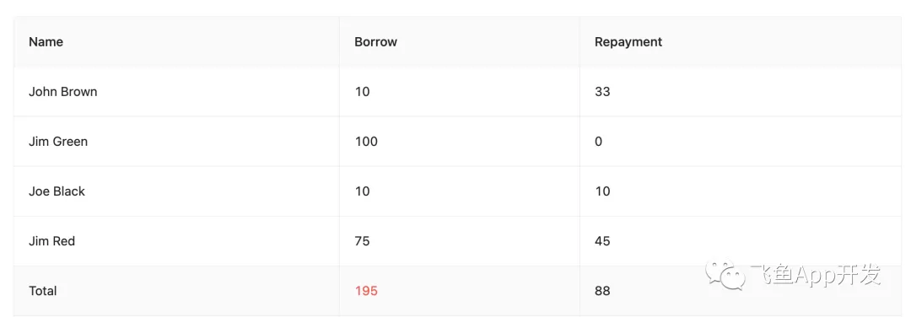

## 一、需求

要实现antd表格的自动汇总功能，如果表格中单元格的值为数字的话，将其相加，生成总结栏，展示在表格底部。类似效果如下图所示：



先来观察我们拿到的表格数据，它的格式是一个包含着对象的数组，其中值为数字的属性是我们要获取的数据，如下所示：


```javascript
const filledLogs = [
  {
    "id": "2d1e7f10-57ac-477a-9b1a-6f537e915a30",
    "timestamp": "1/27/2022 @ 3:16 AM",
    "Tare Weight_unit": "Grams",
    "name": "Batch 1844",
    "cycle": {
      "start": "2021-11-03T15:16:39.024+00:00",
      "end": "2022-02-15T16:16:39.024+00:00",
    },
    "Net Weight_unit": "Grams",
    "Net Weight": 77230,
    "Tare Weight": 10000,
    "Gross Weight": 87230,
    "is_queued": false,
    "manager": {
      "id": "75597beb-769e-4b04-81ae-ef7f5b4e1aa0",
      "name": "Jack White",
    },
    "plant_links": [],
  },
  // ... 更多数据
]
```


这里的难点在于我们要实现的表格的数据结构虽然一样，但具体的数据不是固定的，因此不能通过静态的键值来获取数据。

## 二、思路

由于键值不固定，因此我们需要通过判断对象的值是否为数字来获得对应的key和它的value。

我们的目标是最好能够得到如下的一个对象类型的数据，其中的key为数组中原本的key，它的值为该数组中同一个key的值的总和。

```javascript
{
    "Net Weight": 158101,
    "Tare Weight": 54567,
    "Gross Weight": 212668
}
```


## 三、涉及到的技术


- **lodash** 中的 `_.forEach()`、`_.isNumber()`、`_.get()`、`_.has()` 方法
- **antd** 表格组件总结栏 `<Table.Summary.Row>`、`<Table.Summary.Cell>` 和 Typography 组件中的 `<Text>`


## 四、解决方案

以下是完整的实现代码：

```javascript
// filledLog的格式必须是一个包含对象的数组
summary={(filledLogs) => {
  // 首先定义一个空对象
  let numberSums: { [key: string]: number; } = {};
  
  // 遍历数组filledLogs，获取到其中的每一个对象
  _.forEach(filledLogs, obj => {
    // 继续遍历每一个对象，获取其中的key和value
    _.forEach(obj, (value, key) => {
      // 判断该value是否为数字，如果为数字
      if (_.isNumber(value)) {
        // 通过该数字对应的key在numberSums中取值，默认值为0，赋值给sum变量
        const sum = _.get(numberSums, `${key}`, 0)
        // 然后将sum和该key对应的值相加，再以该key为键值，保存到numberSums中
        // 例如，遍历时，第一次，sum值为0，obj[key]为数组中该key对应的数字，相加后保存到numberSums对象中
        // 第二次，sum被取出，再和key值一致的值相加后保存，覆盖掉原值
        numberSums[key] = sum + obj[key];
      }
    })
  });
  
  return (
    <Table.Summary.Row>
      <Table.Summary.Cell index={0}>Total</Table.Summary.Cell>
      <Table.Summary.Cell index={1}></Table.Summary.Cell>
      {
        // filledLogHeaders是表头的数据，格式也是包含对象的数组
        // 遍历filledLogHeaders数组，拿到每一个对象
        filledLogHeaders.map((item, index) => {
          return (
            <Table.Summary.Cell index={index}>
              <Text>
                {
                  // 检查numberSums是否有以item.title为key的值
                  _.has(numberSums, item.title)
                    // 如果有则显示该值，否则显示'-'
                    ? numberSums[item.title] : '-'
                }
              </Text>
            </Table.Summary.Cell>
          )
        })
      }
    </Table.Summary.Row>
  )
}}
```

## 五、总结

这个解决方案的核心思路是：

1. **动态识别数字字段**：通过 `_.isNumber()` 判断对象中的值是否为数字类型
2. **累加计算**：使用 `_.forEach()` 遍历数据，将相同键名的数字值进行累加
3. **渲染总结行**：使用 antd 的 `Table.Summary` 组件在表格底部显示汇总结果

这种方法的优势在于：
- **通用性强**：不依赖固定的字段名，适用于任何包含数字字段的数据结构
- **可维护性好**：代码逻辑清晰，易于理解和修改
- **性能良好**：使用 lodash 的高效方法进行数据处理

通过这种方式，我们可以轻松地为任何 antd 表格添加自动汇总功能，提升用户体验。